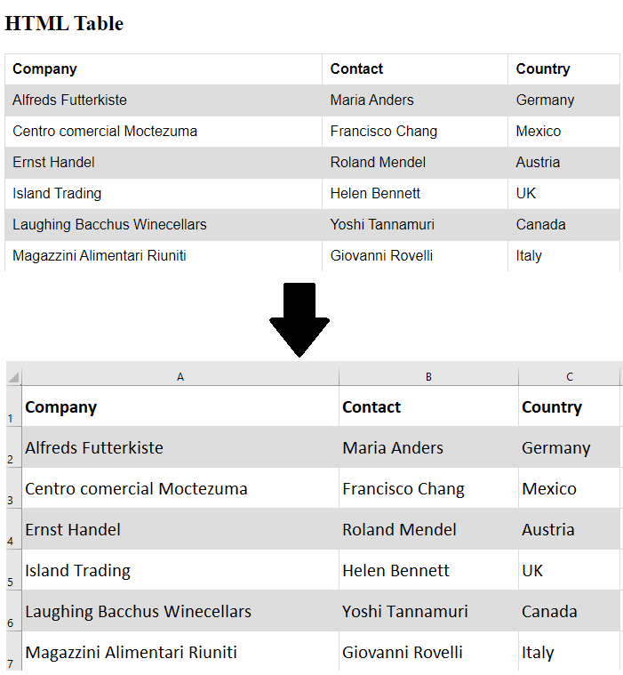

# MR Excel

MR-Excel is a JavaScript library designed for reading and writing Excel files. This library allows you to extract data from Excel files, and when it comes to writing, it offers a range of features such as commenting, styling, Formulas, merging cells,Grouping rows, conditional formatting (Excel), multi-style values, and functions that can be used for cell merging, adding styles and commenting functionalities.

## Table of Contents

<a id="table-of-contents"></a>

> [!NOTE]
> You can return to the table of contents by clicking on ⬆️

- [**`Installation`**](#installation)
- [**`Getting Started`**](#getting-started)
- [**`generateExcel`**](#generate-excel)
  - [**`How to use generateExcel`**](#generate-excel-usage)
  - [**`General`**](#general-option)
  - [**`Header`**](#header)
  - [**`Formula`**](#formula)
  - [**`Styles & Format`**](#styles-format)
  - [**`Conditional Styling`**](#conditional-styling)
  - [**`Conditinal Formating`**](#conditinal-formating)
    - [**`On Column(Header)`**](#conditinal-formating-header)
    - [**`General use`**](#conditinal-formating-general-use)
  - [**`Multi Style value`**](#multi-style-value)
  - [**`Merging Cells`**](#merging-cells)
  - [**`Comment`**](#comment)
  - [**`Group Rows`**](#group-rows)
  - [**`Shift & Title`**](#shift-title)
  - [**`Image Option`**](#image-option)
- [**`convertTableToExcel`**](#convert-table-to-excel)
  - [**`How to use convertTableToExcel`**](#convert-table-to-excel-usage)
- [**`sideBySideLineByLine`**](#side-by-side-line-by-line)
  - [**`How to use sideBySideLineByLine`**](#side-by-side-line-by-line-usage)
- [**`themeBaseGenerate`**](#theme-base-generate)
  - [**`How to use themeBaseGenerate`**](#theme-base-generate-usage)
- [**`extractExcelData`**](#extract-excel-data)
  - [**`How to use extractExcelData`**](#extract-excel-data-usage)
- [**`interface`**](#interface)
- [**`Migrating from 2 to 3`**](#migrating)

<details>

<summary>IMAGES</summary>


</details>

## Introduction [⬆️](#table-of-contents)

Our library offers comprehensive support for a wide range of features, including data formatting, formulas, styles, merged cells, and grouped rows. [Express/backend example](https://github.com/mohammadrezaeicode/mr-excel-repo/tree/main/example/express), [TypeScript example](https://github.com/mohammadrezaeicode/mr-excel-repo/tree/main/example/typescript)

In version 2.1.0, we introduced a new feature called "convertTableToExcel," which enables the generation of an Excel file from a specified table or DOM element (table). The provided query is expected to be a valid input for the querySelector method. This enhancement allows for greater flexibility and convenience when creating Excel files directly from HTML tables.

We have four functions that are defined with specific use cases as follows:

- **`generateExcel`**: This is the primary and most important function that serves as the entry point for all other functions. Its responsibility is to generate an Excel file based on the received input data. We will provide examples of the various options that can be utilized.
  <a id="generate-excel"></a>

- **`convertTableToExcel`**: This function is designed exclusively for **client-side** use. It requires passing a DOM element (a table element) as a parameter. The output of this function is an Excel file generated from the provided table.
  <a id="convert-table-to-excel"></a>

- **`sideBySideLineByLine`**: This function offers the capability to generate a single-sheet Excel file containing multiple tables side by side and line by line.
  <a id="side-by-side-line-by-line"></a>

- **`themeBaseGenerate`**: Within this function, we utilize color palettes from **https://colorhunt.co/**. It accepts data and a theme index as inputs, then generates an Excel file with the selected theme applied.[Themes](https://mohammadrezaeicode.github.io/mr-excel-them-page/)
  <a id="theme-base-generate"></a>

- **`extractExcelData`**: We provide 'extract-excel-data-usage,' which takes the URL of an Excel file that needs to be read, retrieves and reads the data, and returns an object containing the sheets as the result.
  <a id="extract-excel-data"></a>

## Installation [⬆️](#table-of-contents)

<a id="installation"></a>

**Via CDN**

You can utilize our library, which comes bundled with **Vite**, by including the following link:

```html
<script src="https://unpkg.com/mr-excel@latest/dist/excel-table.umd.js"></script>
```

Alternatively, you have the option to use the bundle with **Webpack** by incorporating the link provided below:

```html
<script src="https://unpkg.com/mr-excel@latest/dist2/excel-table.js"></script>
```

Easily integrate our library into your project using either of these methods, and unlock efficient generation of Excel tables with exceptional flexibility.

Using a Package Manager
To seamlessly integrate our library, you can install it using your preferred package manager:

**Via npm**:

```terminal/bash
npm install mr-excel
```

Using **yarn**:

```terminal/bash
npm install mr-excel
```

Alternatively, you have the option to use **pnpm**:

```terminal/bash
npm install mr-excel
```

Choose the package manager that suits your workflow, and effortlessly bring the power of our library into your project, enabling smooth generation of Excel tables with ease and efficiency.

## Getting Started [⬆️](#table-of-contents)

<a id="getting-started"></a>

After adding the library to your project, generating XLSX files becomes straightforward. You can achieve this by creating a data object similar to the code snippet below:

### How to use themeBaseGenerate

<a id="theme-base-generate-usage"></a>

```javascript
let data = {
  sheet: [
    {
      headers: [
        {
          label: "ID",
          text: "ID",
        },
        {
          label: "FirstName",
          text: "First Name",
        },
        {
          label: "LastName",
          text: "Last Name",
        },
        {
          label: "Age",
          text: "Age",
        },
        {
          label: "Email",
          text: "Email",
        },
        {
          label: "PhoneNumber",
          text: "PhoneNumber",
        },
        {
          label: "Address",
          text: "Address",
        },
        {
          label: "Occupation",
          text: "Occupation",
        },
      ],
      data: [
        {
          ID: 1,
          FirstName: "John",
          LastName: "Smith",
          Age: 32,
          Email: "john@example.com",
          PhoneNumber: "555-123-4567",
          Address: "123 Main St, City",
          Occupation: "Engineer",
        },
        {
          ID: 2,
          FirstName: "Jane",
          LastName: "Doe",
          Age: 28,
          Email: "jane@example.com",
          PhoneNumber: "555-987-6543",
          Address: "456 Elm St, Town",
          Occupation: "Teacher",
        },
        {
          ID: 3,
          FirstName: "David",
          LastName: "Johnson",
          Age: 45,
          Email: "david@example.com",
          PhoneNumber: "555-555-5555",
          Address: "789 Oak St, City",
          Occupation: "Doctor",
        },
        {
          ID: 4,
          FirstName: "Sarah",
          LastName: "Brown",
          Age: 22,
          Email: "sarah@example.com",
          PhoneNumber: "555-321-6549",
          Address: "101 Pine St, Town",
          Occupation: "Student",
        },
        {
          ID: 5,
          FirstName: "Michael",
          LastName: "Wilson",
          Age: 38,
          Email: "michael@example.com",
          PhoneNumber: "555-777-8888",
          Address: "246 Maple St, City",
          Occupation: "Lawyer",
        },
        {
          ID: 6,
          FirstName: "Emily",
          LastName: "Davis",
          Age: 29,
          Email: "emily@example.com",
          PhoneNumber: "555-444-3333",
          Address: "555 Birch St, Town",
          Occupation: "Nurse",
        },
        {
          ID: 7,
          FirstName: "Daniel",
          LastName: "Lee",
          Age: 31,
          Email: "daniel@example.com",
          PhoneNumber: "555-666-9999",
          Address: "777 Cedar St, City",
          Occupation: "Software Dev",
        },
        {
          ID: 8,
          FirstName: "Olivia",
          LastName: "White",
          Age: 27,
          Email: "olivia@example.com",
          PhoneNumber: "555-222-1111",
          Address: "888 Redwood St, Town",
          Occupation: "Artist",
        },
        {
          ID: 9,
          FirstName: "James",
          LastName: "Anderson",
          Age: 40,
          Email: "james@example.com",
          PhoneNumber: "555-888-3333",
          Address: "333 Oak St, City",
          Occupation: "Accountant",
        },
        {
          ID: 10,
          FirstName: "Sophia",
          LastName: "Martinez",
          Age: 24,
          Email: "sophia@example.com",
          PhoneNumber: "555-999-7777",
          Address: "666 Pine St, Town",
          Occupation: "Engineer",
        },
      ],
    },
  ],
};
ExcelTable.themeBaseGenerate(data, 0);
```

Or:

```javascript
let data = [
  {
    ID: 1,
    FirstName: "John",
    LastName: "Smith",
    Age: 32,
    Email: "john@example.com",
    PhoneNumber: "555-123-4567",
    Address: "123 Main St, City",
    Occupation: "Engineer",
  },
  {
    ID: 2,
    FirstName: "Jane",
    LastName: "Doe",
    Age: 28,
    Email: "jane@example.com",
    PhoneNumber: "555-987-6543",
    Address: "456 Elm St, Town",
    Occupation: "Teacher",
  },
  {
    ID: 3,
    FirstName: "David",
    LastName: "Johnson",
    Age: 45,
    Email: "david@example.com",
    PhoneNumber: "555-555-5555",
    Address: "789 Oak St, City",
    Occupation: "Doctor",
  },
  {
    ID: 4,
    FirstName: "Sarah",
    LastName: "Brown",
    Age: 22,
    Email: "sarah@example.com",
    PhoneNumber: "555-321-6549",
    Address: "101 Pine St, Town",
    Occupation: "Student",
  },
  {
    ID: 5,
    FirstName: "Michael",
    LastName: "Wilson",
    Age: 38,
    Email: "michael@example.com",
    PhoneNumber: "555-777-8888",
    Address: "246 Maple St, City",
    Occupation: "Lawyer",
  },
  {
    ID: 6,
    FirstName: "Emily",
    LastName: "Davis",
    Age: 29,
    Email: "emily@example.com",
    PhoneNumber: "555-444-3333",
    Address: "555 Birch St, Town",
    Occupation: "Nurse",
  },
  {
    ID: 7,
    FirstName: "Daniel",
    LastName: "Lee",
    Age: 31,
    Email: "daniel@example.com",
    PhoneNumber: "555-666-9999",
    Address: "777 Cedar St, City",
    Occupation: "Software Dev",
  },
  {
    ID: 8,
    FirstName: "Olivia",
    LastName: "White",
    Age: 27,
    Email: "olivia@example.com",
    PhoneNumber: "555-222-1111",
    Address: "888 Redwood St, Town",
    Occupation: "Artist",
  },
  {
    ID: 9,
    FirstName: "James",
    LastName: "Anderson",
    Age: 40,
    Email: "james@example.com",
    PhoneNumber: "555-888-3333",
    Address: "333 Oak St, City",
    Occupation: "Accountant",
  },
  {
    ID: 10,
    FirstName: "Sophia",
    LastName: "Martinez",
    Age: 24,
    Email: "sophia@example.com",
    PhoneNumber: "555-999-7777",
    Address: "666 Pine St, Town",
    Occupation: "Engineer",
  },
];
ExcelTable.themeBaseGenerate(data, 12);
```

### How to use convertTableToExcel

<a id="convert-table-to-excel-usage"></a>

```javascript
ExcelTable.convertTableToExcel("#table");
-------------------------------------------------------------------
let element = document.querySelector("#table");
ExcelTable.convertTableToExcel(null, element, true);
-------------------------------------------------------------------
const rowF = (value, index, from) => {
    return 50
}
const colF = (value, index) => {
    return value * 0.19
}
ExcelTable.convertTableToExcel("#table", null, true, rowF, colF)
```

<details>

<summary>result of Example in https://github.com/mohammadrezaeicode/mr-excel-repo/blob/main/example/conv1.html</summary>



</details>

### How to use extractExcelData

```javascript
ExcelTable.extractExcelData(your excel url);
```

### How to use sideBySideLineByLine

<a id="side-by-side-line-by-line-usage"></a>

`sideBySideLineByLine` is a new feature that enables the generation of multiple tables within a single Excel sheet.

```javascript
const sideData = [
  [
    {
      sheetName: "sheetName",
      spaceX: 1,
      spaceY: 1,
      headers: [
        {
          label: "id",
          text: "id",
        },
      ],
      data: [
        { id: 11 },
        { id: 10 },
        { id: 9 },
        { id: 8 },
        { id: 7 },
        { id: 6 },
        { id: 5 },
        { id: 4 },
        { id: 3 },
        { id: 2 },
        { id: 1 },
      ],
    },
    {
      sheetName: "sheetName",
      spaceX: 1,
      spaceY: 1,
      headers: [
        {
          label: "el",
          text: "el",
        },
      ],
      data: [
        { el: 11 },
        { el: 10 },
        { el: 9 },
        { el: 8 },
        { el: 7 },
        { el: 4 },
        { el: 3 },
        { el: 2 },
        { el: 1 },
      ],
    },
  ],

  [
    {
      sheetName: "sheetName",
      spaceX: 1,
      spaceY: 1,
      headers: [
        {
          label: "id",
          text: "id",
        },
        { label: "test", text: "test" },
      ],
      data: [
        { id: 1 },
        { id: 2 },
        { id: 3 },
        { id: 4 },
        { id: 5 },
        { id: 6 },
        { id: 7 },
        { id: 8 },
        { id: 9 },
        { id: 10 },
        { id: 11 },
      ],
    },
    {
      sheetName: "sheetName1",
      spaceX: 1,
      spaceY: 1,
      headers: [
        {
          label: "id",
          text: "id",
        },
        { label: "test", text: "test" },
      ],
      data: [
        { id: 1 },
        { id: 2 },
        { id: 3 },
        { id: 4 },
        { id: 5 },
        { id: 6 },
        { id: 7 },
        { id: 8 },
        { id: 9 },
        { id: 10 },
        { id: 11 },
      ],
    },
    {
      sheetName: "sheetName",
      spaceX: 1,
      spaceY: 1,
      headers: [
        {
          label: "id",
          text: "id",
        },
        { label: "test", text: "test" },
      ],
      data: [
        { test: "test14", id: "u1i1r23" },
        { test: "test13", id: "u2i2r24" },
        { test: "test12", id: "u3i3r25" },
        { test: "test11", id: "u4i4r26" },
        { test: "test10", id: "u5i5r27" },
        { test: "test9", id: "u6i6r28" },
        { test: "test8", id: "u7i7r29" },
        { test: "test7", id: "u8i8r30" },
        { test: "test6", id: "u9i9r31" },
        { test: "test5", id: "ui1010r32" },
        { test: "test4", id: "ui1111r33" },
        { test: "test3" },
        { test: "test2" },
        { test: "test1" },
      ],
    },
  ],
];
ExcelTable.sideBySideLineByLine(sideData);
```

### generateExcel

<a id="generate-excel-usage"></a>

```javascript
//<https://colorhunt.co/palette/f9ed69f08a5db83b5e6a2c70>
const colorPalette = {
  c1: "F9ED69",
  c2: "#F08A5D",
  c3: "B83B5E",
  c4: "6A2C70",
};
const data = {
  creator: "mr",
  created: "2023-08-06T07:22:40Z",
  modified: "2023-08-06T07:22:40Z",
  styles: {
    formulaStyle: {
      backgroundColor: "B83B5E",
      border: {
        full: {
          style: "medium",
          color: "F9ED69",
        },
      },
    },
    headerStyle: {
      backgroundColor: "F9ED69",
      color: "#F08A5D",
      bold: true,
    },
    rowStyle: {
      backgroundColor: "#F08A5D",
      color: "F9ED69",
    },
  },
  sheet: [
    {
      name: "Test",
      formula: {
        B16: {
          type: "SUM",
          start: "B2",
          end: "B8",
          styleId: "formulaStyle",
        },
      },
      tabColor: "B83B5E",
      headers: [
        {
          label: "test",
          text: "Test",
        },
        {
          label: "_id",
          text: "ID",
          formula: {
            type: "MAX",
            styleId: "formulaStyle",
          },
        },
      ],
      data: [
        {
          _id: 0.3,
          test: "test1",
        },
        {
          _id: 2,
          test: "dsssssssssssss",
        },
        {
          _id: 3,
          test: "test3",
        },
        {
          _id: 4,
          test: "test4",
        },
        {
          _id: 5,
          test: "test5",
        },
        {
          _id: 6,
          test: "test6",
        },
        {
          _id: 7,
          test: "test7",
        },
        {
          _id: 8,
          test: "test8",
        },
        {
          _id: 9,
          test: "test9",
        },
        {
          _id: 10,
          test: "test10",
        },
        {
          _id: 11,
          test: "test11",
        },
      ],
    },
    {
      headers: [
        {
          label: "test",
          text: "Test",
        },
        {
          label: "_id",
          text: "ID",
        },
      ],
      data: [
        {
          _id: 1,
          test: "test1",
        },
        {
          _id: 2,
          test: "test2",
        },
        {
          _id: 3,
          test: "test3",
        },
        {
          _id: 4,
          test: "test4",
        },
        {
          _id: 5,
          test: "test5",
        },
        {
          _id: 6,
          test: "test6",
        },
        {
          _id: 7,
          test: "test7",
        },
        {
          _id: 8,
          test: "test8",
        },
        {
          _id: 9,
          test: "test9",
        },
        {
          _id: 10,
          test: "test10",
        },
        {
          _id: 11,
          test: "test11",
        },
      ],
    },
  ],
};
ExcelTable.generateExcel(data);
```

## General option [⬆️](#table-of-contents)

<a id="general-option"></a>

Each sheet has options for customization. You can change the sheet name using name, adjust the tab name color with tabColor, control visibility with state, add protection to a sheet via protectionOption, and implement sorting and filtering using sortAndfilter. In the example below, we will demonstrate how to utilize these properties. Additionally, for Excel file information, we offer options such as creator, created, notSave, and modified.

> [!NOTE]
> Please use the protectionOption only when necessary, as it may potentially lead to broken generated files. We recommend avoiding the use of other sheet options as well.

> [!IMPORTANT]
> Excel file information such as `name`, `created`, and `modified` is extremely sensitive. If incorrect values are used, it can result in Excel file generation issues. Please exercise extra caution and ensure accurate values for these attributes to avoid any potential disruptions.

<details>
<summary>Display code</summary>

```javascript
const data = {
  notSave: true,
  creator: "mr",
  created: "2023-08-12T02:08:04.469Z",
  modified: "2023-08-12T02:08:04.469Z",
  sheet: [
    {
      name: "family record",
      tabColor: "#a1b4c6",
      sortAndfilter: {
        mode: "all",
      },
      protectionOption: {
        sheet: 1,
        formatCells: 0,
        formatColumns: 0,
        formatRows: 0,
        insertColumns: 0,
        insertRows: 0,
        insertHyperlinks: 0,
        deleteColumns: 0,
        deleteRows: 0,
        sort: 0,
        autoFilter: 0,
        pivotTables: 0,
      },
      headers: [
        {
          label: "id",
          text: "ID",
        },
        {
          label: "name",
          text: "Name",
        },
        {
          label: "surname",
          text: "Surname",
        },
        {
          label: "parentId",
          text: "Parent Id",
        },
        {
          label: "work",
          text: "Work",
        },
        {
          label: "birthDate",
          text: "Birth Date",
        },
      ],
      data: [
        {
          id: 7209449538085,
          name: "Tabitha",
          surname: "Terry",
          parentId: 6998520522169,
          work: "Computer repair technician",
          birthDate: "1853-04-10T01:23:16.181Z",
        },
        {
          id: 4132538644996,
          name: "Grace",
          surname: "MacTavish",
          parentId: 6840142476821,
          work: "Retired",
          birthDate: "1854-04-03T08:51:19.825Z",
        },
        {
          id: 778493423064,
          name: "Bailey",
          surname: "Byram",
          parentId: 7137102781494,
          work: "Occupational Therapist- Neonatal/ Pediatric",
          birthDate: "1852-08-13T18:07:57.408Z",
        },
        {
          id: 510141747289,
          name: "Sherman",
          surname: "Joseph",
          parentId: 602149579197,
          work: "work from home",
          birthDate: "1854-12-12T05:48:31.806Z",
        },
        {
          id: 5513277402976,
          name: "Ryder",
          surname: "Watrous",
          parentId: 7435302183884,
          work: "Welder",
          birthDate: "1854-08-18T04:11:04.736Z",
        },
        {
          id: 1032906540606,
          name: "Phoenix",
          surname: "Netter",
          parentId: 3204642808212,
          work: "Unemployed",
          birthDate: "1854-07-19T07:53:58.843Z",
        },
        {
          id: 343574032284,
          name: "Tonya",
          surname: "Carpenter",
          parentId: 3709985684199,
          work: "Pulmonologist",
          birthDate: "1852-04-20T12:44:08.362Z",
        },
        {
          id: 9497014533965,
          name: "Coral",
          surname: "Hoskins",
          parentId: 3497153671269,
          work: "Unemployed",
          birthDate: "1854-12-01T22:08:59.891Z",
        },
        {
          id: 4998374693826,
          name: "Billie",
          surname: "Guthrie",
          parentId: 1555796128163,
          work: "Skomorokh",
          birthDate: "1853-11-10T14:06:54.037Z",
        },
        {
          id: 95132218987,
          name: "Gertrude",
          surname: "Clark",
          parentId: 2324519652998,
          work: "Unemployed",
          birthDate: "1852-12-22T20:12:13.237Z",
        },
      ],
    },
    {
      state: "hidden",
      headers: [
        {
          label: "id",
          text: "ID",
        },
        {
          label: "name",
          text: "Name",
        },
        {
          label: "surname",
          text: "Surname",
        },
        {
          label: "parentId",
          text: "Parent Id",
        },
        {
          label: "work",
          text: "Work",
        },
        {
          label: "birthDate",
          text: "Birth Date",
        },
      ],
      data: [
        {
          id: 7209449538085,
          name: "Tabitha",
          surname: "Terry",
          parentId: 6998520522169,
          work: "Computer repair technician",
          birthDate: "1853-04-10T01:23:16.181Z",
        },
        {
          id: 4132538644996,
          name: "Grace",
          surname: "MacTavish",
          parentId: 6840142476821,
          work: "Retired",
          birthDate: "1854-04-03T08:51:19.825Z",
        },
        {
          id: 778493423064,
          name: "Bailey",
          surname: "Byram",
          parentId: 7137102781494,
          work: "Occupational Therapist- Neonatal/ Pediatric",
          birthDate: "1852-08-13T18:07:57.408Z",
        },
        {
          id: 510141747289,
          name: "Sherman",
          surname: "Joseph",
          parentId: 602149579197,
          work: "work from home",
          birthDate: "1854-12-12T05:48:31.806Z",
        },
        {
          id: 5513277402976,
          name: "Ryder",
          surname: "Watrous",
          parentId: 7435302183884,
          work: "Welder",
          birthDate: "1854-08-18T04:11:04.736Z",
        },
        {
          id: 1032906540606,
          name: "Phoenix",
          surname: "Netter",
          parentId: 3204642808212,
          work: "Unemployed",
          birthDate: "1854-07-19T07:53:58.843Z",
        },
        {
          id: 343574032284,
          name: "Tonya",
          surname: "Carpenter",
          parentId: 3709985684199,
          work: "Pulmonologist",
          birthDate: "1852-04-20T12:44:08.362Z",
        },
        {
          id: 9497014533965,
          name: "Coral",
          surname: "Hoskins",
          parentId: 3497153671269,
          work: "Unemployed",
          birthDate: "1854-12-01T22:08:59.891Z",
        },
        {
          id: 4998374693826,
          name: "Billie",
          surname: "Guthrie",
          parentId: 1555796128163,
          work: "Skomorokh",
          birthDate: "1853-11-10T14:06:54.037Z",
        },
        {
          id: 95132218987,
          name: "Gertrude",
          surname: "Clark",
          parentId: 2324519652998,
          work: "Unemployed",
          birthDate: "1852-12-22T20:12:13.237Z",
        },
        {
          id: 4353606351491,
          name: "Corinna",
          surname: "Powell",
          parentId: 6303270085856,
          work: "Business analyst",
          birthDate: "1853-05-13T14:00:27.525Z",
        },
        {
          id: 9821977853501,
          name: "Alexander",
          surname: "Rowlands",
          parentId: 5281151854805,
          work: "work from home",
          birthDate: "1852-07-29T02:34:26.818Z",
        },
        {
          id: 1789259068865,
          name: "Khloe",
          surname: "Allsebrook",
          parentId: 9085712911231,
          work: "Internet celebrity",
          birthDate: "1853-10-10T01:28:17.141Z",
        },
        {
          id: 1547071460137,
          name: "Sky",
          surname: "Hyde",
          parentId: 3932330547777,
          work: "Retired",
          birthDate: "1854-11-03T05:06:37.477Z",
        },
        {
          id: 8054019194308,
          name: "Niles",
          surname: "Dudley",
          parentId: 9487606369042,
          work: "Porter",
          birthDate: "1852-09-01T05:46:03.040Z",
        },
        {
          id: 6759490924297,
          name: "Valda",
          surname: "Bye",
          parentId: 5146431233541,
          work: "Management",
          birthDate: "1853-09-29T00:33:43.968Z",
        },
        {
          id: 6625148457816,
          name: "Keaton",
          surname: "Boothe",
          parentId: 4935663844945,
          work: "Mental Health Counselor",
          birthDate: "1854-10-25T16:56:16.488Z",
        },
        {
          id: 5968154253225,
          name: "Gill",
          surname: "Voyles",
          parentId: 1358001926693,
          work: "Ophthalmologist",
          birthDate: "1853-09-13T06:48:43.632Z",
        },
        {
          id: 7963337332727,
          name: "Josiah",
          surname: "Engleman",
          parentId: 4661422144081,
          work: "Unemployed",
          birthDate: "1854-05-31T14:12:01.180Z",
        },
        {
          id: 7276643575609,
          name: "Luca",
          surname: "Alderman",
          parentId: 1257836499862,
          work: "Unemployed",
          birthDate: "1852-07-04T12:18:59.130Z",
        },
        {
          id: 4670743239553,
          name: "Kathleen",
          surname: "Walle",
          parentId: 4441682230999,
          work: "Computer scientist",
          birthDate: "1854-08-22T11:02:53.945Z",
        },
        {
          id: 7400518637533,
          name: "Deacon",
          surname: "Humpherys",
          parentId: 1446747090804,
          work: "Conservation officer",
          birthDate: "1854-06-07T15:31:11.006Z",
        },
        {
          id: 6500156651299,
          name: "Carina",
          parentId: 5968154253225,
          surname: "Voyles",
          work: "Chiropodist",
          birthDate: "1867-02-15T16:59:13.152Z",
        },
        {
          id: 1706294044283,
          name: "Tucker",
          parentId: 7963337332727,
          surname: "Engleman",
          work: "Podiatrist",
          birthDate: "1866-12-09T07:32:17.900Z",
        },
        {
          id: 3173442171339,
          name: "Clarissa",
          surname: "Harvie",
          parentId: 8355293899833,
          work: "Botanist",
          birthDate: "1853-03-29T17:49:36.408Z",
        },
        {
          id: 5788750055334,
          name: "Melina",
          parentId: 6500156651299,
          surname: "Voyles",
          work: "Welder",
          birthDate: "1882-08-16T00:50:47.934Z",
        },
        {
          id: 8843316769405,
          name: "Keith",
          surname: "Ludington",
          parentId: 6356556019596,
          work: "Usher",
          birthDate: "1852-06-15T06:27:32.233Z",
        },
        {
          id: 4207038883417,
          name: "Aaliyah",
          surname: "Woodville",
          parentId: 5819329552655,
          work: "Scop",
          birthDate: "1854-10-08T02:36:29.656Z",
        },
        {
          id: 8313555968957,
          name: "Harper",
          surname: "Allcock",
          parentId: 7731940327551,
          work: "Songwriter",
          birthDate: "1853-05-09T23:05:40.195Z",
        },
        {
          id: 8321384691545,
          name: "Johnny",
          parentId: 778493423064,
          surname: "Byram",
          work: "Copy editor",
          birthDate: "1873-12-17T06:16:58.798Z",
        },
        {
          id: 8774024011461,
          name: "Jody",
          parentId: 4132538644996,
          surname: "MacTavish",
          work: "Graphic designer",
          birthDate: "1872-08-31T01:04:39.456Z",
        },
        {
          id: 3306066401344,
          name: "Mercedes",
          surname: "Roberts",
          parentId: 6748854838600,
          work: "Feller",
          birthDate: "1852-05-10T11:58:05.415Z",
        },
        {
          id: 6496588012690,
          name: "Renee",
          parentId: 8054019194308,
          surname: "Dudley",
          work: "Plumber",
          birthDate: "1873-12-17T21:54:18.411Z",
        },
        {
          id: 2454674611066,
          name: "Jill",
          parentId: 6759490924297,
          surname: "Bye",
          work: "Dermatology Physician Assistant",
          birthDate: "1865-03-20T17:31:14.827Z",
        },
        {
          id: 8810365866300,
          name: "Townsend",
          parentId: 6496588012690,
          surname: "Dudley",
          work: "Psychiatric Nurse Practitioner",
          birthDate: "1885-09-06T14:23:00.439Z",
        },
        {
          id: 1971028749432,
          name: "George",
          surname: "Georgeson",
          parentId: 3375820364841,
          work: "Director",
          birthDate: "1854-10-26T04:21:32.595Z",
        },
        {
          id: 1113599419684,
          name: "Jess",
          surname: "Summers",
          parentId: 8197445224794,
          work: "Showrunner",
          birthDate: "1853-06-20T11:49:42.822Z",
        },
        {
          id: 260692577513,
          name: "Salma",
          surname: "Bagshaw",
          parentId: 8646582409037,
          work: "Technical director",
          birthDate: "1854-08-02T11:08:13.512Z",
        },
        {
          id: 4717646566698,
          name: "Jakob",
          parentId: 7400518637533,
          surname: "Humpherys",
          work: "Draper",
          birthDate: "1875-09-29T02:59:25.272Z",
        },
        {
          id: 2812851588162,
          name: "Ezekiel",
          surname: "Glanton",
          parentId: 8694260373371,
          work: "Retired",
          birthDate: "1853-07-25T22:30:11.069Z",
        },
        {
          id: 546554428930,
          name: "Darrin",
          parentId: 7963337332727,
          surname: "Engleman",
          work: "Healthcare science",
          birthDate: "1867-11-05T12:21:08.349Z",
        },
        {
          id: 5568159710759,
          name: "Kirsten",
          parentId: 6496588012690,
          surname: "Dudley",
          work: "work from home",
          birthDate: "1890-06-13T12:43:09.597Z",
        },
        {
          id: 3385269771452,
          name: "Emerald",
          parentId: 6496588012690,
          surname: "Dudley",
          work: "Retired",
          birthDate: "1892-05-01T07:40:24.011Z",
        },
        {
          id: 8533172021814,
          name: "Andre",
          parentId: 8321384691545,
          surname: "Byram",
          work: "Retired",
          birthDate: "1892-02-25T01:12:38.146Z",
        },
        {
          id: 4710524419131,
          name: "Patty",
          surname: "Dick",
          parentId: 1760988033690,
          work: "Technical writer",
          birthDate: "1853-01-11T14:35:24.298Z",
        },
        {
          id: 1805461552938,
          name: "Elisha",
          surname: "Bradford",
          parentId: 8622160581630,
          work: "Theatre practitioner",
          birthDate: "1853-06-30T19:11:12.105Z",
        },
        {
          id: 6542853113042,
          name: "Zoe",
          parentId: 3173442171339,
          surname: "Harvie",
          work: "Showgirl",
          birthDate: "1870-12-08T18:18:09.844Z",
        },
        {
          id: 1718991242108,
          name: "Drew",
          surname: "Ashby",
          parentId: 3010550761310,
          work: "Retired",
          birthDate: "1854-10-23T05:29:23.476Z",
        },
        {
          id: 1334633156399,
          name: "Marie",
          surname: "Tibbets",
          parentId: 2575362966990,
          work: "Geotechnical Engineer",
          birthDate: "1854-09-01T14:29:47.329Z",
        },
        {
          id: 5668998711075,
          name: "Dulcie",
          surname: "Derwin",
          parentId: 7518120488089,
          work: "Emcee",
          birthDate: "1854-03-09T04:56:18.697Z",
        },
        {
          id: 248786146102,
          name: "Shania",
          surname: "Fleetwood",
          parentId: 7804160535710,
          work: "Station",
          birthDate: "1854-10-06T02:01:08.206Z",
        },
        {
          id: 9525762609317,
          name: "Ana",
          parentId: 7209449538085,
          surname: "Terry",
          work: "Manager (Guard)",
          birthDate: "1867-07-30T11:59:23.739Z",
        },
        {
          id: 934688923249,
          name: "Alicia",
          parentId: 6542853113042,
          surname: "Harvie",
          work: "Blogger",
          birthDate: "1890-10-06T17:26:42.673Z",
        },
        {
          id: 7306715236916,
          name: "Petula",
          surname: "Newey",
          parentId: 1042642003017,
          work: "Geoff",
          birthDate: "1852-10-04T08:37:28.785Z",
        },
        {
          id: 8234536999381,
          name: "Mary",
          surname: "Rose",
          parentId: 5386302345101,
          work: "Signal maintainer",
          birthDate: "1854-02-15T23:14:32.174Z",
        },
        {
          id: 7494359933717,
          name: "Brittany",
          parentId: 1805461552938,
          surname: "Bradford",
          work: "Unemployed",
          birthDate: "1875-01-06T09:30:49.999Z",
        },
        {
          id: 7049262735491,
          name: "Juniper",
          surname: "Marks",
          parentId: 9127368958939,
          work: "work from home",
          birthDate: "1854-11-26T11:05:44.683Z",
        },
        {
          id: 7781822521224,
          name: "Edris",
          surname: "Godwin",
          parentId: 6016143008277,
          work: "work from home",
          birthDate: "1854-09-13T08:22:46.191Z",
        },
        {
          id: 9078112227633,
          name: "Kaitlin",
          surname: "Minogue",
          parentId: 95176825076,
          work: "Clinical pharmaceutical scientist",
          birthDate: "1852-05-08T21:59:27.773Z",
        },
        {
          id: 3055221397713,
          name: "Lauretta",
          parentId: 6759490924297,
          surname: "Bye",
          work: "Track inspector",
          birthDate: "1867-05-21T06:07:21.273Z",
        },
        {
          id: 3794107972026,
          name: "Dorothy",
          surname: "Bostick",
          parentId: 6850128149597,
          work: "Go-go dancer",
          birthDate: "1853-03-06T19:01:31.143Z",
        },
        {
          id: 1698494645377,
          name: "Cameron",
          surname: "Torney",
          parentId: 770004791023,
          work: "Advertising designer",
          birthDate: "1854-07-17T07:16:12.429Z",
        },
        {
          id: 841895938898,
          name: "Shepherd",
          parentId: 4717646566698,
          surname: "Humpherys",
          work: "Quilter",
          birthDate: "1897-02-23T22:01:59.520Z",
        },
        {
          id: 7914083691988,
          name: "Alisha",
          surname: "Wind",
          parentId: 1656884957449,
          work: "Veterinarian",
          birthDate: "1853-04-04T07:49:55.453Z",
        },
        {
          id: 5015337941343,
          name: "Agnes",
          parentId: 9821977853501,
          surname: "Rowlands",
          work: "Rhapsode",
          birthDate: "1865-09-14T16:07:21.238Z",
        },
        {
          id: 6498601438355,
          name: "Harvard",
          parentId: 1971028749432,
          surname: "Georgeson",
          work: "Retired",
          birthDate: "1874-02-03T05:44:32.483Z",
        },
        {
          id: 6162073883494,
          name: "Lizzie",
          surname: "Allitt",
          parentId: 7443156411879,
          work: "work from home",
          birthDate: "1854-02-09T14:41:55.210Z",
        },
        {
          id: 4027876312592,
          name: "Samuel",
          parentId: 8843316769405,
          surname: "Ludington",
          work: "Neuroradiographer",
          birthDate: "1864-11-13T01:39:02.494Z",
        },
        {
          id: 6910084039563,
          name: "Layla",
          parentId: 95132218987,
          surname: "Clark",
          work: "CT Radiographer",
          birthDate: "1868-09-02T07:10:46.829Z",
        },
        {
          id: 2583927007530,
          name: "Darby",
          surname: "Yeakel",
          parentId: 1323435182904,
          work: "Data designer",
          birthDate: "1853-05-12T16:14:07.161Z",
        },
        {
          id: 7448530790803,
          name: "Winnifred",
          surname: "Rykener",
          parentId: 9181202451521,
          work: "Unemployed",
          birthDate: "1852-03-20T06:48:07.162Z",
        },
        {
          id: 4842667119782,
          name: "Lacey",
          parentId: 7400518637533,
          surname: "Humpherys",
          work: "Unemployed",
          birthDate: "1875-03-04T17:56:15.949Z",
        },
        {
          id: 3926090190617,
          name: "Beverley",
          surname: "McHatton",
          parentId: 8769830982857,
          work: "Field warden",
          birthDate: "1853-06-02T04:00:57.288Z",
        },
        {
          id: 5107646185720,
          name: "Cassidy",
          parentId: 7276643575609,
          surname: "Alderman",
          work: "Retired",
          birthDate: "1863-12-22T05:38:41.764Z",
        },
        {
          id: 6617379016460,
          name: "Jeannie",
          surname: "Artley",
          parentId: 5730519222203,
          work: "Psychologist",
          birthDate: "1854-11-06T11:20:41.234Z",
        },
        {
          id: 5415904134291,
          name: "Shannon",
          parentId: 5513277402976,
          surname: "Watrous",
          work: "Artistic director",
          birthDate: "1872-02-22T13:25:42.485Z",
        },
        {
          id: 8625554360699,
          name: "Margot",
          surname: "Glidewell",
          parentId: 5710615384493,
          work: "Rhapsode",
          birthDate: "1854-10-31T13:03:27.754Z",
        },
        {
          id: 2167634099186,
          name: "Annie",
          parentId: 9497014533965,
          surname: "Hoskins",
          work: "Spotlight Operator",
          birthDate: "1866-11-19T12:52:54.706Z",
        },
        {
          id: 2969518168386,
          name: "Velma",
          parentId: 7209449538085,
          surname: "Terry",
          work: "Web developer",
          birthDate: "1871-10-28T11:08:07.215Z",
        },
        {
          id: 9376340620106,
          name: "Cheryl",
          parentId: 1706294044283,
          surname: "Engleman",
          work: "Stunt performer",
          birthDate: "1877-10-11T10:56:39.191Z",
        },
        {
          id: 4611179134961,
          name: "Mayola",
          surname: "Whyte",
          parentId: 2106785096820,
          work: "Painters",
          birthDate: "1854-12-18T21:34:21.340Z",
        },
        {
          id: 3330893717600,
          name: "Imogen",
          surname: "Brinkley",
          parentId: 4855829489899,
          work: "Nephrology Physician Assistant",
          birthDate: "1853-02-02T11:36:44.244Z",
        },
        {
          id: 2322780495725,
          name: "Gillian",
          parentId: 8313555968957,
          surname: "Allcock",
          work: "Rhapsode",
          birthDate: "1871-08-02T14:41:44.723Z",
        },
        {
          id: 9096773496327,
          name: "Crossley",
          surname: "Oatway",
          parentId: 4983996020215,
          work: "Flagman",
          birthDate: "1854-09-04T11:14:16.967Z",
        },
        {
          id: 7912768369102,
          name: "Jack",
          surname: "Cortright",
          parentId: 1954893391139,
          work: "Racing driver",
          birthDate: "1852-08-02T03:15:25.294Z",
        },
        {
          id: 4936706920188,
          name: "Marilyn",
          parentId: 1805461552938,
          surname: "Bradford",
          work: "Park ranger",
          birthDate: "1868-03-15T10:44:36.661Z",
        },
        {
          id: 4507151706136,
          name: "Malcolm",
          surname: "Fish",
          parentId: 10892055752,
          work: "Otorhinolaryngology Physician assistant",
          birthDate: "1852-09-21T09:57:38.875Z",
        },
        {
          id: 1002471008138,
          name: "Sapphire",
          surname: "Plumb",
          parentId: 7581067886471,
          work: "Physical Therapist",
          birthDate: "1853-10-01T07:37:10.197Z",
        },
        {
          id: 935177490762,
          name: "Cracroft",
          parentId: 4710524419131,
          surname: "Dick",
          work: "Emergency medical technician",
          birthDate: "1874-06-28T07:03:04.205Z",
        },
        {
          id: 3214614421553,
          name: "Sparrow",
          surname: "Ashbridge",
          parentId: 957660638347,
          work: "Deputy Station Master",
          birthDate: "1852-04-10T04:05:16.806Z",
        },
        {
          id: 7486640594543,
          name: "Krista",
          surname: "Pancake",
          parentId: 7378652821449,
          work: "Plumber",
          birthDate: "1854-08-23T21:50:03.378Z",
        },
        {
          id: 4208092032684,
          name: "Jolie",
          surname: "Williamson",
          parentId: 542240779474,
          work: "Stage crew",
          birthDate: "1853-10-29T00:38:32.373Z",
        },
        {
          id: 265753551687,
          name: "Holbrook",
          parentId: 4936706920188,
          surname: "Bradford",
          work: "Hack writer",
          birthDate: "1884-05-07T02:08:54.196Z",
        },
        {
          id: 8299001953232,
          name: "Robert",
          parentId: 3173442171339,
          surname: "Harvie",
          work: "Ticketing agent",
          birthDate: "1873-06-05T02:00:54.119Z",
        },
        {
          id: 4569395503128,
          name: "Heather",
          surname: "Exton",
          parentId: 9258857749445,
          work: "Millwright",
          birthDate: "1854-07-30T13:43:50.734Z",
        },
        {
          id: 3805806644419,
          name: "Avis",
          surname: "Waddington",
          parentId: 7607565215691,
          work: "Soloist",
          birthDate: "1853-05-16T10:13:10.174Z",
        },
        {
          id: 215914970248,
          name: "Lanna",
          parentId: 3926090190617,
          surname: "McHatton",
          work: "Poet",
          birthDate: "1871-10-23T19:08:06.184Z",
        },
        {
          id: 405274833240,
          name: "Demetria",
          parentId: 4670743239553,
          surname: "Walle",
          work: "Signalman",
          birthDate: "1874-07-17T12:36:59.100Z",
        },
        {
          id: 2703780723460,
          name: "Grayson",
          parentId: 7914083691988,
          surname: "Wind",
          work: "Bylaw enforcement officer",
          birthDate: "1866-08-17T16:34:36.854Z",
        },
        {
          id: 2649091306594,
          name: "Kathryn",
          parentId: 8313555968957,
          surname: "Allcock",
          work: "Station",
          birthDate: "1874-09-20T04:49:58.207Z",
        },
      ],
    },
  ],
};
ExcelTable.generateExcel(data).then((res) => {
  var url = window.URL.createObjectURL(res);
  window.location.assign(url);
  return res;
});
```

</details>

<details>
<summary>result image</summary>


</details>

## Header Option [⬆️](#table-of-contents)

<a id="header"></a>

We offer specific header options for Excel headers. The header is a mandatory component, so the withoutHeader option cannot be used to omit it. The headerHeight option is employed to determine the height of the header row. Additionally, we provide the headerStyleKey property, which specifies the most commonly used style for each cell (its value corresponds to the style ID; detailed functionality is explained in the Styles section).

Each header cell is endowed with properties beyond the label and text. The size property defines the width of the column, while the formula property applies a formula to all rows (excluding the header) within the column, ultimately affecting the final cell in that column.

<details>
<summary>Display code</summary>

```javascript
function e() {
  const t = { c1: "08D9D6", c2: "252A34", c3: "FF2E63", c4: "EAEAEA" };
  return {
    imageFullName: "ex3.PNG",
    url: "https://colorhunt.co/palette/08d9d6252a34ff2e63eaeaea",
    colorPalette: t,
    data: {
      creator: "mr",
      styles: {
        headerStyle: {
          backgroundColor: t.c2,
          fontFamily: "Times New Roman",
          color: t.c4,
          size: 20,
        },
        formulaStyle: {
          backgroundColor: t.c1,
          fontFamily: "Times New Roman",
          color: t.c3,
          size: 15,
        },
      },
      sheet: [
        {
          headerStyleKey: "headerStyle",
          headerHeight: 30,
          headers: [
            {
              label: "id",
              text: "ID",
              size: 20,
              formula: { type: "COUNT", styleId: "formulaStyle" },
            },
            { label: "name", text: "Name", size: 20 },
            { label: "surname", text: "Surname", size: 20 },
            { label: "parentId", text: "Parent Id", size: 20 },
            { label: "work", text: "Work", size: 20 },
            { label: "birthDate", text: "Birth Date", size: 30 },
          ],
          data: Fr.slice(0, 10),
        },
        {
          withoutHeader: !0,
          headerStyleKey: "headerStyle",
          headers: [
            {
              label: "id",
              text: "ID",
              size: 70,
              formula: { type: "COUNT", styleId: "formulaStyle" },
            },
            { label: "name", text: "Name", size: 12 },
            { label: "surname", text: "Surname", size: 70 },
            { label: "parentId", text: "Parent Id", size: 100 },
            { label: "work", text: "Work", size: 100 },
            { label: "birthDate", text: "Birth Date", size: 100 },
          ],
          data: Fr.slice(0, 10),
        },
      ],
    },
  };
}
const { data } = e();
ExcelTable.generateExcel(data);
```

</details>

</details>

<details>
<summary>result image</summary>


</details>

## Formula Option [⬆️](#table-of-contents)

<a id="formula"></a>

We provide two distinct methods for defining formulas: customization and column type. In the customization approach, if you employ a cell containing data that is used within the formula, the formula will display an instance of the formula. When using the customization type, it's important to specify the formula type, which can be any of the following: AVERAGE, SUM, COUNT, MAX, or MIN.

<details>
<summary>Display code</summary>

```javascript
const colorPalette = {
  c1: "2B2E4A",
  c2: "E84545",
  c3: "903749",
  c4: "53354A",
};
const data = {
  creator: "mr",
  styles: {
    headerStyle: {
      backgroundColor: "2B2E4A",
      fontFamily: "Times New Roman",
      color: "E84545",
    },
    customFormulaStyle: {
      backgroundColor: "E84545",
      fontFamily: "Times New Roman",
      color: "2B2E4A",
      size: 15,
      border: {
        full: {
          color: "53354A",
          style: "dashDot",
        },
      },
    },
    formulaStyle: {
      backgroundColor: "2B2E4A",
      fontFamily: "Times New Roman",
      color: "E84545",
      size: 15,
      border: {
        full: {
          color: "903749",
          style: "medium",
        },
      },
    },
  },
  sheet: [
    {
      formula: {
        A8: {
          type: "SUM",
          start: "B2",
          end: "D3",
          styleId: "customFormulaStyle",
        },
        B8: {
          type: "AVERAGE",
          start: "A2",
          end: "F6",
          styleId: "customFormulaStyle",
        },
        C8: {
          type: "SUM",
          start: "A2",
          end: "F6",
          styleId: "customFormulaStyle",
        },
        D8: {
          type: "MAX",
          start: "A2",
          end: "F6",
          styleId: "customFormulaStyle",
        },
        E8: {
          type: "MIN",
          start: "A2",
          end: "F6",
          styleId: "customFormulaStyle",
        },
        F8: {
          type: "COUNT",
          start: "A2",
          end: "F6",
          styleId: "customFormulaStyle",
        },
      },
      headerStyleKey: "headerStyle",
      headers: [
        {
          label: "Date",
          text: "Date",
          formula: {
            styleId: "formulaStyle",
            type: "COUNT",
          },
        },
        {
          label: "Column 1",
          text: "Column 1",
          formula: {
            styleId: "formulaStyle",
            type: "AVERAGE",
          },
        },
        {
          label: "Column 2",
          text: "Column 2",
          formula: {
            styleId: "formulaStyle",
            type: "SUM",
          },
        },
        {
          label: "Column 3",
          text: "Column 3",
          formula: {
            styleId: "formulaStyle",
            type: "MAX",
          },
        },
        {
          label: "Column 4",
          text: "Column 4",
          formula: {
            styleId: "formulaStyle",
            type: "MIN",
          },
        },
        {
          label: "Column 5",
          text: "Column 5",
          formula: {
            styleId: "formulaStyle",
            type: "COUNT",
          },
        },
      ],
      data: [
        {
          Date: "2023-08-01",
          "Column 1": 5,
          "Column 2": 10,
          "Column 3": 15,
          "Column 4": 20,
          "Column 5": 25,
        },
        {
          Date: "2023-08-02",
          "Column 1": 7,
          "Column 2": 14,
          "Column 3": 21,
          "Column 4": 28,
          "Column 5": 35,
        },
        {
          Date: "2023-08-03",
          "Column 1": 3,
          "Column 2": 6,
          "Column 3": 9,
          "Column 4": 12,
          "Column 5": 15,
        },
        {
          Date: "2023-08-04",
          "Column 1": 12,
          "Column 2": 24,
          "Column 3": 36,
          "Column 4": 48,
          "Column 5": 60,
        },
        {
          Date: "2023-08-05",
          "Column 1": 8,
          "Column 2": 16,
          "Column 3": 24,
          "Column 4": 32,
          "Column 5": 40,
        },
      ],
    },
  ],
};
ExcelTable.generateExcel(data);
```

</details>

<details>
<summary>result image</summary>


</details>

## Styles & Format Options [⬆️](#table-of-contents)

<a id="styles-format"></a>

In the library, styles are defined with an ID that represents the desired style. This ID is then used to apply the corresponding style to cells. Each cell is associated with only one style. These styles encompass various attributes such as borders, alignment, text color, font family, font size, background, and bold, among others.

The format property is a distinct style attribute. Unlike other styles, the format is predefined and cannot be customized.

<details>
<summary>Display code</summary>

```javascript
function e() {
  const t = { c1: "2C3639", c2: "3F4E4F", c3: "A27B5C", c4: "DCD7C9" },
    n = { backgroundColor: t.c2, fontFamily: "Times New Roman", color: t.c4 },
    a = { backgroundColor: t.c4, fontFamily: "Times New Roman", color: t.c2 };
  return {
    url: "https://colorhunt.co/palette/ffcfdffefdcae0f9b5a5dee5",
    imageFullName: "ex5.PNG",
    colorPalette: t,
    data: {
      creator: "mr",
      styles: {
        Date: { ...n, format: "short_date" },
        Time: { ...n, format: "time" },
        Percentage: { ...n, format: "percentage" },
        Float: { ...n, format: "float_2", alignment: { horizontal: "left" } },
        Fraction: { ...n, format: "fraction" },
        "Long Number Column 1": {
          ...n,
          format: "dollar_2",
          alignment: { indent: 3, rtl: !0, horizontal: "left" },
        },
        "Long Number Column 2": {
          ...n,
          format: "num_sep",
          alignment: { ltr: !0, horizontal: "left" },
        },
        headerStyle: { ...a },
      },
      sheet: [
        {
          styleCellCondition(l, r, o, i, s, u) {
            return s
              ? "headerStyle"
              : o == 0
              ? "Date"
              : o == 1
              ? "Time"
              : o == 2
              ? "Percentage"
              : o == 3
              ? "Float"
              : o == 4
              ? "Fraction"
              : o == 5
              ? "Long Number Column 1"
              : "Long Number Column 2";
          },
          headers: [
            { label: "Date", text: "Date" },
            { label: "Time", text: "Time" },
            { label: "Percentage", text: "Percentage" },
            { label: "Float", text: "Float" },
            { label: "Fraction", text: "Fraction" },
            {
              label: "Long Number Column 1",
              text: "Long Number Column 1",
              size: 50,
            },
            {
              label: "Long Number Column 2",
              text: "Long Number Column 2",
              size: 50,
            },
          ],
          data: [
            {
              Date: "2023-08-01",
              Time: "09:00 AM",
              Percentage: 0.7525,
              Float: 0.7525,
              Fraction: "1/4",
              "Long Number Column 1": 0x7048860ddf79,
              "Long Number Column 2": 987654321098765,
            },
            {
              Date: "2023-08-02",
              Time: "02:30 PM",
              Percentage: 0.4275,
              Float: 0.4275,
              Fraction: "3/8",
              "Long Number Column 1": 456789012345678,
              "Long Number Column 2": 876543210987654,
            },
            {
              Date: "2023-08-03",
              Time: "10:45 AM",
              Percentage: 0.955,
              Float: 0.955,
              Fraction: "5/6",
              "Long Number Column 1": 789012345678901,
              "Long Number Column 2": 765432109876543,
            },
            {
              Date: "2023-08-04",
              Time: "04:15 PM",
              Percentage: 0.2875,
              Float: 0.2875,
              Fraction: "2/7",
              "Long Number Column 1": 0x70472c442cb1,
              "Long Number Column 2": 654321098765432,
            },
            {
              Date: "2023-08-05",
              Time: "08:20 AM",
              Percentage: 0.6,
              Float: 0.6,
              Fraction: "4/5",
              "Long Number Column 1": 543210987654321,
              "Long Number Column 2": 543210987654321,
            },
          ],
        },
      ],
    },
  };
}
const { data } = e();
ExcelTable.generateExcel(data);
```

</details>

<details>
<summary>result image</summary>


</details>

## Merging Cells Options [⬆️](#table-of-contents)

<a id="merging-cells"></a>

We offer options for merging rows of cells together. Additionally, we provide a function-based approach to facilitate cell merging.

<details>
<summary>Display code</summary>

```javascript
function e() {
  const t = { c1: "DBE2EF", c2: "112D4E", c4: "F9F7F7" },
    n = {
      backgroundColor: t.c2,
      fontFamily: "Times New Roman",
      color: t.c4,
      border: { full: { style: "medium", color: t.c1 } },
      alignment: { horizontal: "left", vertical: "top" },
    },
    a = { backgroundColor: t.c4, fontFamily: "Times New Roman", color: t.c2 },
    l = [];
  let r = !1;
  return {
    url: "https://colorhunt.co/palette/f9f7f7dbe2ef3f72af112d4e",
    imageFullName: "ex6.PNG",
    colorPalette: t,
    data: {
      creator: "mr",
      styles: {
        Date: { ...n, format: "short_date" },
        Time: { ...n, format: "time" },
        Percentage: { ...n, format: "percentage" },
        Float: { ...n, format: "float_2" },
        Fraction: { ...n, format: "fraction" },
        "Long Number Column 1": { ...n, format: "dollar_2" },
        "Long Number Column 2": { ...n, format: "num_sep" },
        headerStyle: { ...a },
      },
      sheet: [
        {
          mergeRowDataCondition(o, i, s, u) {
            return u
              ? !1
              : r
              ? l[i] == o
                ? !0
                : ((l[i] = o), !1)
              : ((r = !0), (l[i] = o), !0);
          },
          styleCellCondition(o, i, s, u, c, m) {
            return c
              ? "headerStyle"
              : s == 0
              ? "Date"
              : s == 1
              ? "Time"
              : s == 2
              ? "Percentage"
              : s == 3
              ? "Float"
              : s == 4
              ? "Fraction"
              : s == 5
              ? "Long Number Column 1"
              : "Long Number Column 2";
          },
          headers: [
            { label: "Date", text: "Date" },
            { label: "Time", text: "Time" },
            { label: "Percentage", text: "Percentage" },
            { label: "Float", text: "Float" },
            { label: "Fraction", text: "Fraction" },
            {
              label: "Long Number Column 1",
              text: "Long Number Column 1",
              size: 50,
            },
            {
              label: "Long Number Column 2",
              text: "Long Number Column 2",
              size: 50,
            },
          ],
          data: [
            {
              Date: "2023-08-01",
              Time: "09:00 AM",
              Percentage: 0.7525,
              Float: 0.7525,
              Fraction: "1/4",
              "Long Number Column 1": 0x7048860ddf79,
              "Long Number Column 2": 987654321098765,
            },
            {
              Date: "2023-08-01",
              Time: "02:30 PM",
              Percentage: 0.4275,
              Float: 0.4275,
              Fraction: "3/8",
              "Long Number Column 1": 0x7048860ddf79,
              "Long Number Column 2": 876543210987654,
            },
            {
              Date: "2023-08-03",
              Time: "10:45 AM",
              Percentage: 0.955,
              Float: 0.955,
              Fraction: "5/6",
              "Long Number Column 1": 789012345678901,
              "Long Number Column 2": 765432109876543,
            },
            {
              Date: "2023-08-04",
              Time: "04:15 PM",
              Percentage: 0.2875,
              Float: 0.2875,
              Fraction: "2/7",
              "Long Number Column 1": 0x70472c442cb1,
              "Long Number Column 2": 654321098765432,
            },
            {
              Date: "2023-08-05",
              Time: "08:20 AM",
              Percentage: 0.6,
              Float: 0.6,
              Fraction: "4/5",
              "Long Number Column 1": 543210987654321,
              "Long Number Column 2": 543210987654321,
            },
            {
              Date: "2023-08-05",
              Time: "08:20 AM",
              Percentage: 0.6,
              Float: 0.6,
              Fraction: "4/5",
              "Long Number Column 1": 543210987654321,
              "Long Number Column 2": 543210987654321,
            },
            {
              Date: "2023-08-05",
              Time: "08:20 AM",
              Percentage: 0.6,
              Float: 0.61,
              Fraction: "4/5",
              "Long Number Column 1": 543210987654321,
              "Long Number Column 2": 543210987654321,
            },
          ],
        },
      ],
    },
  };
}
const { data } = e();
ExcelTable.generateExcel(data);
```

</details>

<details>
<summary>result image</summary>


</details>

## Group Rows Options [⬆️](#table-of-contents)

<a id="group-rows"></a>

With this library, you can group rows together using two properties added to the data: outlineLevel and hidden. The outlineLevel represents the grouping level, while hidden represents whether the default state is collapsed or not. The key of this property is changeable, so in case of a conflict with your data, you have the flexibility to modify it. We will discuss how to change the key in the next section.

<details>
<summary>Display code</summary>

```javascript
function e() {
  const t = { c4: "FCD1D1", c2: "AEE1E1" },
    n = {
      backgroundColor: t.c2,
      fontFamily: "Times New Roman",
      color: "112D4E",
      alignment: { horizontal: "left", vertical: "top" },
    },
    a = {
      backgroundColor: t.c4,
      fontFamily: "Times New Roman",
      color: "112D4E",
    };
  return {
    imageFullName: "ex7.PNG",
    colorPalette: t,
    url: "https://colorhunt.co/palette/fcd1d1ece2e1d3e0dcaee1e1",
    data: {
      creator: "mr",
      styles: { rowStyle: { ...n }, headerStyle: { ...a } },
      sheet: [
        {
          styleCellCondition(l, r, o, i, s, u) {
            return s ? "headerStyle" : "rowStyle";
          },
          headers: [
            { label: "ID", text: "ID" },
            { label: "Name", text: "Name" },
            { label: "Column 1", text: "Column 1" },
            { label: "Column 2", text: "Column 2" },
            { label: "Column 3", text: "Column 3" },
            { label: "Column 4", text: "Column 4" },
            { label: "Column 5", text: "Column 5" },
          ],
          data: [
            {
              ID: 1,
              Name: "Category A",
              "Column 1": 10,
              "Column 2": 20,
              "Column 3": 30,
              "Column 4": 40,
              "Column 5": 50,
              outlineLevel: 1,
            },
            {
              ID: 2,
              Name: "Item 1",
              "Column 1": 5,
              "Column 2": 10,
              "Column 3": 15,
              "Column 4": 20,
              "Column 5": 25,
              outlineLevel: 2,
            },
            {
              ID: 3,
              Name: "Item 2",
              "Column 1": 3,
              "Column 2": 6,
              "Column 3": 9,
              "Column 4": 12,
              "Column 5": 15,
              outlineLevel: 2,
            },
            {
              ID: 4,
              Name: "Item 3",
              "Column 1": 2,
              "Column 2": 4,
              "Column 3": 6,
              "Column 4": 8,
              "Column 5": 10,
              outlineLevel: 2,
            },
            {
              ID: 5,
              Name: "Category B",
              "Column 1": 20,
              "Column 2": 40,
              "Column 3": 60,
              "Column 4": 80,
              "Column 5": 100,
              outlineLevel: 1,
            },
            {
              ID: 6,
              Name: "Item 1",
              "Column 1": 10,
              "Column 2": 20,
              "Column 3": 30,
              "Column 4": 40,
              "Column 5": 50,
              hidden: 1,
              outlineLevel: 2,
            },
            {
              ID: 7,
              Name: "Item 2",
              "Column 1": 6,
              "Column 2": 12,
              "Column 3": 18,
              "Column 4": 24,
              "Column 5": 30,
              hidden: 1,
              outlineLevel: 2,
            },
            {
              ID: 8,
              Name: "Item 3",
              "Column 1": 4,
              "Column 2": 8,
              "Column 3": 12,
              "Column 4": 16,
              "Column 5": 20,
              hidden: 1,
              outlineLevel: 2,
            },
            {
              ID: 9,
              Name: "Category C",
              "Column 1": 30,
              "Column 2": 60,
              "Column 3": 90,
              "Column 4": 120,
              "Column 5": 150,
              outlineLevel: 1,
            },
            {
              ID: 10,
              Name: "Item 1",
              "Column 1": 15,
              "Column 2": 30,
              "Column 3": 45,
              "Column 4": 60,
              "Column 5": 75,
              outlineLevel: 2,
            },
            {
              ID: 11,
              Name: "Item 2",
              "Column 1": 9,
              "Column 2": 18,
              "Column 3": 27,
              "Column 4": 36,
              "Column 5": 45,
              outlineLevel: 2,
            },
            {
              ID: 12,
              Name: "Item 3",
              "Column 1": 6,
              "Column 2": 12,
              "Column 3": 18,
              "Column 4": 24,
              "Column 5": 30,
              outlineLevel: 2,
            },
            {
              ID: 13,
              Name: "Summary",
              "Column 1": 60,
              "Column 2": 120,
              "Column 3": 180,
              "Column 4": 240,
              "Column 5": 300,
              outlineLevel: 3,
            },
          ],
        },
      ],
    },
  };
}
const { data } = e();
ExcelTable.generateExcel(data);
```

</details>

<details>
<summary>result image</summary>


</details>

## Complex Options [⬆️](#table-of-contents)

In the examples below, we aim to define some fun scenarios that could be useful for more complex use cases.

Adjusting Key Properties and Row Height
You have the ability to change the key of reserved properties such as height, hidden, and more. Additionally, you can adjust the height of rows as needed.

<details>
<summary>Display code</summary>

```javascript
function e() {
  const t = { c4: "F08A5D", c2: "F9ED69" },
    n = {
      backgroundColor: t.c2,
      fontFamily: "Times New Roman",
      color: "6A2C70",
      alignment: { horizontal: "left", vertical: "center" },
    },
    a = {
      backgroundColor: t.c4,
      fontFamily: "Times New Roman",
      color: "6A2C70",
    };
  return {
    imageFullName: "ex8.PNG",
    colorPalette: t,
    url: "https://colorhunt.co/palette/f9ed69f08a5db83b5e6a2c70",
    data: {
      creator: "mr",
      mapSheetDataOption: {
        hidden: "notShow",
        height: "h",
        outlineLevel: "group",
      },
      styles: { rowStyle: { ...n }, headerStyle: { ...a } },
      sheet: [
        {
          styleCellCondition(l, r, o, i, s, u) {
            return s ? "headerStyle" : "rowStyle";
          },
          headers: [
            { label: "ID", text: "ID" },
            { label: "Name", text: "Name" },
            { label: "Column 1", text: "Column 1" },
            { label: "Column 2", text: "Column 2" },
            { label: "Column 3", text: "Column 3" },
            { label: "Column 4", text: "Column 4" },
            { label: "Column 5", text: "Column 5" },
          ],
          data: [
            {
              ID: 1,
              Name: "Category A",
              "Column 1": 10,
              "Column 2": 20,
              "Column 3": 30,
              "Column 4": 40,
              "Column 5": 50,
              h: 30,
              group: 1,
            },
            {
              ID: 2,
              Name: "Item 1",
              "Column 1": 5,
              "Column 2": 10,
              "Column 3": 15,
              "Column 4": 20,
              "Column 5": 25,
              h: 30,
              group: 2,
            },
            {
              ID: 3,
              Name: "Item 2",
              "Column 1": 3,
              "Column 2": 6,
              "Column 3": 9,
              "Column 4": 12,
              "Column 5": 15,
              h: 30,
              group: 2,
            },
            {
              ID: 4,
              Name: "Item 3",
              "Column 1": 2,
              "Column 2": 4,
              "Column 3": 6,
              "Column 4": 8,
              "Column 5": 10,
              h: 30,
              group: 2,
            },
            {
              ID: 5,
              Name: "Category B",
              "Column 1": 20,
              "Column 2": 40,
              "Column 3": 60,
              "Column 4": 80,
              "Column 5": 100,
              h: 30,
              group: 1,
            },
            {
              ID: 6,
              Name: "Item 1",
              "Column 1": 10,
              "Column 2": 20,
              "Column 3": 30,
              "Column 4": 40,
              "Column 5": 50,
              notShow: 1,
              h: 30,
              group: 2,
            },
            {
              ID: 7,
              Name: "Item 2",
              "Column 1": 6,
              "Column 2": 12,
              "Column 3": 18,
              "Column 4": 24,
              "Column 5": 30,
              notShow: 1,
              h: 30,
              group: 2,
            },
            {
              ID: 8,
              Name: "Item 3",
              "Column 1": 4,
              "Column 2": 8,
              "Column 3": 12,
              "Column 4": 16,
              "Column 5": 20,
              notShow: 1,
              h: 30,
              group: 2,
            },
            {
              ID: 9,
              Name: "Category C",
              "Column 1": 30,
              "Column 2": 60,
              "Column 3": 90,
              "Column 4": 120,
              "Column 5": 150,
              h: 30,
              group: 1,
            },
            {
              ID: 10,
              Name: "Item 1",
              "Column 1": 15,
              "Column 2": 30,
              "Column 3": 45,
              "Column 4": 60,
              "Column 5": 75,
              h: 30,
              group: 2,
            },
            {
              ID: 11,
              Name: "Item 2",
              "Column 1": 9,
              "Column 2": 18,
              "Column 3": 27,
              "Column 4": 36,
              "Column 5": 45,
              h: 30,
              group: 2,
            },
            {
              ID: 12,
              Name: "Item 3",
              "Column 1": 6,
              "Column 2": 12,
              "Column 3": 18,
              "Column 4": 24,
              "Column 5": 30,
              h: 30,
              group: 2,
            },
            {
              ID: 13,
              Name: "Summary",
              "Column 1": 60,
              "Column 2": 120,
              "Column 3": 180,
              "Column 4": 240,
              "Column 5": 300,
              h: 30,
              group: 3,
            },
          ],
        },
      ],
    },
  };
}
const { data } = e();
ExcelTable.generateExcel(data);
```

</details>

<details>
<summary>result image</summary>


</details>

## Shift & Title Option [⬆️](#table-of-contents)

<a id="shift-title"></a>
The shift feature allows you to adjust the starting point of generating an Excel file. The title option, on the other hand, is used when you want to include a title at the top of the generated file.

<details>
<summary>Display code</summary>

```javascript
function generateData() {
  const colorPalette = {
    c4: "FFC7C7",
    c2: "8785A2",
  };
  const rowAlignment = {
    alignment: {
      horizontal: "left",
      vertical: "center",
    },
  };
  const rowStyle = {
    backgroundColor: colorPalette.c2,
    fontFamily: "Times New Roman",
    color: "6A2C70",
    ...rowAlignment,
  };
  const headerStyle = {
    backgroundColor: colorPalette.c4,
    fontFamily: "Times New Roman",
    color: "#FFFFFF",
  };
  return {
    imageFullName: "ex10.PNG",
    colorPalette,
    url: "https://colorhunt.co/palette/ffc7c7ffe2e2f6f6f68785a2",
    data: {
      creator: "mr",
      styles: {
        "c0<0.3": {
          backgroundColor: "DCD6F7",
          color: "424874s",
          ...rowAlignment,
        },
        male: {
          backgroundColor: "95E1D3",
          color: "252A34",
          ...rowAlignment,
        },
        female: {
          backgroundColor: "F38181",
          color: "252A34",
          ...rowAlignment,
        },
        rowStyle: {
          ...rowStyle,
        },
        headerStyle: {
          ...headerStyle,
        },
      },
      sheet: [
        {
          shiftTop: 5,
          shiftLeft: 5,
          styleCellCondition(data, fullData, colIndex, rowIndex, fromHeader) {
            if (fromHeader) {
              return "headerStyle";
            } else {
              if (colIndex == 0 && data < 0.3) {
                return "c0<0.3";
              } else if (colIndex == 3) {
                if (data) {
                  return "male";
                } else {
                  return "female";
                }
              } else {
                return "rowStyle";
              }
            }
          },
          headers: [
            { label: "c1", text: "**" },
            { label: "c2", text: "++" },
            { label: "c3", text: "Name" },
            { label: "c5", text: "Gender" },
          ],
          data: [
            { c1: 0.756, c2: 150, c3: "John", c5: 1 },
            { c1: 0.238, c2: 120, c3: "Jane", c5: 0 },
            { c1: 0.865, c2: 180, c3: "Michael", c5: 1 },
            { c1: 0.412, c2: 130, c3: "Emily", c5: 0 },
            { c1: 0.587, c2: 160, c3: "William", c5: 1 },
          ],
        },
      ],
    },
  };
}
const { data } = generateData();
ExcelTable.generateExcel(data);
```

</details>

## Comment Option [⬆️](#table-of-contents)

<a id="comment"></a>

After version 2.4.0 you can add comment on cells.

<details>
<summary>Display code</summary>

```javascript
function generateData() {
  const colorPalette = {
    c4: "61677A",
    c2: "FFF6E0",
  };
  const rowAlignment = {
    alignment: {
      horizontal: "left",
      vertical: "center",
    },
  };
  const rowStyle = {
    backgroundColor: colorPalette.c2,
    fontFamily: "Times New Roman",
    color: "6A2C70",
    ...rowAlignment,
  };
  const headerStyle = {
    backgroundColor: colorPalette.c4,
    fontFamily: "Times New Roman",
    color: "#FFFFFF",
  };
  return {
    imageFullName: "ex14.PNG",
    colorPalette,
    url: "https://colorhunt.co/",
    data: {
      addDefaultTitleStyle: true,
      creator: "mr",
      styles: {
        "c0<0.3": {
          backgroundColor: "DCD6F7",
          color: "424874s",
          ...rowAlignment,
        },
        male: {
          backgroundColor: "95E1D3",
          color: "252A34",
          ...rowAlignment,
        },
        female: {
          backgroundColor: "F38181",
          color: "252A34",
          ...rowAlignment,
        },
        rowStyle: {
          ...rowStyle,
        },
        headerStyle: {
          ...headerStyle,
        },
      },
      sheet: [
        {
          shiftTop: 1,
          shiftLeft: 1,
          title: {
            comment: "This is comment on table",
            shiftTop: 1,
            shiftLeft: -1,
            consommeRow: 4,
            consommeCol: 6,
            // height: 100,
            // styleId: '',
            text: "Title",
          },
          commentCodition: function (
            data,
            object,
            headerKey,
            rowIndex,
            colIndex,
            fromHeader
          ) {
            console.log("called");
            if (fromHeader) {
              let textDataC0 = data.text.charAt(0);
              if (textDataC0.toUpperCase() != textDataC0) {
                return {
                  comment: `
Header should start with ${textDataC0.toUpperCase()}`,
                  author: "System",
                };
              }
            }
            return false;
          },
          styleCellCondition(data, fullData, colIndex, rowIndex, fromHeader) {
            if (fromHeader) {
              return "headerStyle";
            } else {
              if (colIndex == 0 && data < 0.3) {
                return "c0<0.3";
              } else if (colIndex == 3) {
                if (data) {
                  return "male";
                } else {
                  return "female";
                }
              } else {
                return "rowStyle";
              }
            }
          },
          headers: [
            {
              label: "c1",
              text: "**",
              comment: {
                author: "mr",
                comment: "misspell in header",
              },
            },
            { label: "c2", text: "++" },
            { label: "c3", text: "Name" },
            { label: "c5", text: "gender" },
          ],
          data: [
            { c1: 0.756, c2: 150, c3: "John", c5: 1 },
            {
              c1: 0.238,
              c2: 120,
              c3: "Jane",
              c5: 0,
              comment: {
                c3: "Comment on Jane",
              },
            },
            { c1: 0.865, c2: 180, c3: "Michael", c5: 1 },
            { c1: 0.412, c2: 130, c3: "Emily", c5: 0 },
            { c1: 0.587, c2: 160, c3: "William", c5: 1 },
          ],
        },
      ],
    },
  };
}
const { data } = generateData();
ExcelTable.generateExcel(data);
```

</details>

## Multi Style value Option [⬆️](#table-of-contents)

<a id="multi-style-value"></a>

After version 2.4.0, We added Ability to change the style of each character of cells. (only text value)

<details>
<summary>Display code</summary>

```javascript
function generateData() {
  const colorPalette = {
    c4: "F7E987",
    c2: "5B9A8B",
  };
  const rowAlignment = {
    alignment: {
      horizontal: "left",
      vertical: "center",
    },
  };
  const rowStyle = {
    backgroundColor: colorPalette.c2,
    fontFamily: "Times New Roman",
    color: "6A2C70",
    ...rowAlignment,
  };
  const headerStyle = {
    backgroundColor: colorPalette.c4,
    fontFamily: "Times New Roman",
    color: "#000000",
  };
  return {
    imageFullName: "ex15.PNG",
    colorPalette,
    url: "https://colorhunt.co/palette/f8ede3dfd3c3d0b8a885586f",
    data: {
      addDefaultTitleStyle: true,
      creator: "mr",
      styles: {
        title: {
          size: 48,
          backgroundColor: "E5BA73",
          alignment: {
            horizontal: "left",
            vertical: "top",
          },
        },
        t2: {
          color: "FFFFFF",
        },
        t1: {
          color: "555555",
        },
        "c0<0.3": {
          backgroundColor: "DCD6F7",
          color: "424874s",
          ...rowAlignment,
        },
        male: {
          backgroundColor: "95E1D3",
          color: "252A34",
          ...rowAlignment,
        },
        female: {
          backgroundColor: "F38181",
          color: "252A34",
          ...rowAlignment,
        },
        rowStyle: {
          ...rowStyle,
        },
        headerStyle: {
          ...headerStyle,
        },
      },
      sheet: [
        {
          shiftTop: 1,
          shiftLeft: 1,
          title: {
            comment: "This is comment on table",
            shiftTop: 1,
            shiftLeft: -1,
            consommeRow: 4,
            consommeCol: 6,
            multiStyleValue: {
              reg: [
                {
                  reg: /t/gi,
                  styleId: "t2",
                },
              ],
            },
            // height: 100,
            styleId: "title",
            text: "Title",
          },
          commentCodition: function (
            data,
            object,
            headerKey,
            rowIndex,
            colIndex,
            fromHeader
          ) {
            console.log("called");
            if (fromHeader) {
              let textDataC0 = data.text.charAt(0);
              if (textDataC0.toUpperCase() != textDataC0) {
                return {
                  comment: `
Header should start with ${textDataC0.toUpperCase()}`,
                  author: "System",
                };
              }
            }
            return false;
          },
          styleCellCondition(data, fullData, colIndex, rowIndex, fromHeader) {
            if (fromHeader) {
              return "headerStyle";
            } else {
              if (colIndex == 0 && data < 0.3) {
                return "c0<0.3";
              } else if (colIndex == 3) {
                if (data) {
                  return "male";
                } else {
                  return "female";
                }
              } else {
                return "rowStyle";
              }
            }
          },
          headers: [
            {
              label: "c1",
              text: "**",
              comment: {
                author: "mr",
                comment: "misspell in header",
              },
            },
            {
              label: "c2",
              text: "++",
            },
            {
              label: "c3",
              text: "Name",
              multiStyleValue: {
                N: "t1",
                a: "t2",
              },
            },
            { label: "c5", text: "gender" },
          ],
          data: [
            { c1: 0.756, c2: 150, c3: "John", c5: 1 },
            {
              c1: 0.238,
              c2: 120,
              c3: "Jane",
              c5: 0,
              comment: {
                c3: "Comment on Jane",
              },
            },
            { c1: 0.865, c2: 180, c3: "Michael", c5: 1 },
            { c1: 0.412, c2: 130, c3: "Emily", c5: 0 },
            { c1: 0.587, c2: 160, c3: "William", c5: 1 },
          ],
        },
      ],
    },
  };
}
const { data } = generateData();
ExcelTable.generateExcel(data);
```

```javascript
function e() {
  const t = { c4: "00ADB5", c2: "393E46" },
    n = { alignment: { horizontal: "left", vertical: "center" } },
    a = {
      backgroundColor: t.c2,
      fontFamily: "Times New Roman",
      color: "6A2C70",
      ...n,
    },
    l = {
      backgroundColor: t.c4,
      fontFamily: "Times New Roman",
      color: "#000000",
    };
  return {
    imageFullName: "ex16.PNG",
    colorPalette: t,
    url: "https://colorhunt.co/palette/f9ed69f08a5db83b5e6a2c70",
    data: {
      addDefaultTitleStyle: !0,
      creator: "mr",
      styles: {
        col2: {
          color: "#F9ED69",
        },
        col1: {
          color: "#FF2E63",
        },
        title: {
          size: 48,
          backgroundColor: "F9ED69",
          color: "6A2C70",
          alignment: { horizontal: "center", vertical: "center" },
        },
        t2: { color: "F08A5D" },
        t1: { color: "555555" },
        "c0<0.3": { backgroundColor: "DCD6F7", color: "424874s", ...n },
        male: { backgroundColor: "95E1D3", color: "252A34", ...n },
        female: { backgroundColor: "F38181", color: "252A34", ...n },
        rowStyle: { ...a },
        headerStyle: { ...l },
      },
      sheet: [
        {
          useSplitBaseOnMatch: true,
          shiftTop: 1,
          shiftLeft: 1,
          title: {
            comment: "This is comment on table",
            shiftTop: 1,
            shiftLeft: -1,
            consommeRow: 4,
            consommeCol: 6,
            multiStyleValue: {
              "+": "t1",
              ".": "t1",
              "|": "t1",
              "\\": "t1",
              reg: [{ reg: /t/gi, styleId: "t2" }],
            },
            styleId: "title",
            text: "Title 1",
          },
          multiStyleConditin: function (
            data,
            object,
            headerKey,
            rowIndex,
            colIndex,
            fromHeader
          ) {
            if (fromHeader) {
              let charList = data.text.match(/./g);
              let result = charList.reduce(
                (res, curr, index) => {
                  try {
                    new RegExp(curr);
                  } catch (error) {
                    curr = "\\" + curr;
                  }
                  if (index % 2 == 0) {
                    res.result.reg.push({
                      reg: new RegExp("[" + curr + "]"),
                      styleId: "col1",
                    });
                    return res;
                  } else {
                    res.result.reg.push({
                      reg: new RegExp("[" + curr + "]"),
                      styleId: "col2",
                    });
                    return res;
                  }
                },
                { curr: "", result: { reg: [] } }
              );
              return result.result;
            } else {
              let charList = data.match(/./g);
              let result = charList.reduce(
                (res, curr, index) => {
                  try {
                    new RegExp(curr);
                  } catch (error) {
                    curr = "\\" + curr;
                  }
                  if (index % 2 == 0) {
                    res.result.reg.push({
                      reg: new RegExp("[" + curr + "]"),
                      styleId: "col1",
                    });
                    return res;
                  } else {
                    res.result.reg.push({
                      reg: new RegExp("[" + curr + "]"),
                      styleId: "col2",
                    });
                    return res;
                  }
                },
                { curr: "", result: { reg: [] } }
              );

              return result.result;
            }
          },
          commentCodition: function (o, r, i, s, u, c) {
            if ((console.log("called"), c)) {
              let d = o.text.charAt(0);
              if (d.toUpperCase() != d)
                return {
                  comment: `
Header should start with ${d.toUpperCase()}`,
                  author: "System",
                };
            }
            return !1;
          },
          styleCellCondition(o, r, i, s, u) {
            return u
              ? "headerStyle"
              : i == 0 && o < 0.3
              ? "c0<0.3"
              : i == 3
              ? o
                ? "male"
                : "female"
              : "rowStyle";
          },
          headers: [
            {
              label: "c1",
              text: "**",
              comment: { author: "mr", comment: "misspell in header" },
            },
            { label: "c2", text: "++" },
            {
              label: "c3",
              text: "Name",
              multiStyleValue: { N: "t1", a: "t2" },
            },
            { label: "c5", text: "gender" },
          ],
          data: [
            { c1: "0.756", c2: "150", c3: "John", c5: "1" },
            {
              c1: "0.238",
              c2: "120",
              c3: "Jane",
              c5: "0",
              comment: { c3: "Comment on Jane" },
            },
            { c1: "0.865", c2: "180", c3: "Michael", c5: "1" },
            { c1: "0.412", c2: "130", c3: "Emily", c5: "0" },
            { c1: "0.587", c2: "160", c3: "William", c5: "1" },
          ],
        },
      ],
    },
  };
}
const { data } = e();
ExcelTable.generateExcel(data);
```

</details>

<details>
<summary>result image</summary>


</details>

## Conditional Styling [⬆️](#table-of-contents)

<a id="conditional-styling"></a>

Using the 'styleCellCondition' option, you can apply styles to each cell based on specific conditions as needed.

<details>
<summary>Display code</summary>

```javascript
function e() {
  const t = { c4: "2B2E4A", c2: "E84545" },
    n = { alignment: { horizontal: "left", vertical: "center" } },
    a = {
      backgroundColor: t.c2,
      fontFamily: "Times New Roman",
      color: "6A2C70",
      ...n,
    },
    l = {
      backgroundColor: t.c4,
      fontFamily: "Times New Roman",
      color: "#FFFFFF",
    };
  return {
    imageFullName: "ex9.PNG",
    colorPalette: t,
    url: "https://colorhunt.co/palette/2b2e4ae8454590374953354a",
    data: {
      creator: "mr",
      styles: {
        "c0<0.3": { backgroundColor: "DCD6F7", color: "424874s", ...n },
        male: { backgroundColor: "95E1D3", color: "252A34", ...n },
        female: { backgroundColor: "F38181", color: "252A34", ...n },
        rowStyle: { ...a },
        headerStyle: { ...l },
      },
      sheet: [
        {
          styleCellCondition(r, o, i, s, u, c) {
            return u
              ? "headerStyle"
              : i == 0 && r < 0.3
              ? "c0<0.3"
              : i == 3
              ? r
                ? "male"
                : "female"
              : "rowStyle";
          },
          headers: [
            { label: "c1", text: "**" },
            { label: "c2", text: "++" },
            { label: "c3", text: "Name" },
            { label: "c5", text: "Gender" },
          ],
          data: [
            { c1: 0.756, c2: 150, c3: "John", c5: 1 },
            { c1: 0.238, c2: 120, c3: "Jane", c5: 0 },
            { c1: 0.865, c2: 180, c3: "Michael", c5: 1 },
            { c1: 0.412, c2: 130, c3: "Emily", c5: 0 },
            { c1: 0.587, c2: 160, c3: "William", c5: 1 },
          ],
        },
      ],
    },
  };
}
const { data } = e();
ExcelTable.generateExcel(data);
```

</details>

## Conditinal Formating [⬆️](#table-of-contents)

<a id="conditinal-formating"></a>

You can apply Excel conditional formatting in two ways. One method is through the Header object, which affects a whole column. The other method is using the Sheet object, where you need to specify the start and end properties.

<details>
<summary>Display code</summary>

```javascript
const data = {
  activateConditinalFormating: true,
  styles: {
    ct: {
      type: "conditinalFormating",
      backgroundColor: "222831",
      color: "EEEEEE",
    },
  },
  sheet: [
    {
      conditinalFormating: [
        {
          type: "dataBar",
          start: "A2",
          end: "B6",
        },
        {
          type: "colorScale",
          start: "C2",
          end: "C6",
        },
        {
          type: "top",
          start: "D2",
          end: "D6",
          value: 2,
        },
        {
          type: "top",
          start: "E2",
          end: "E6",
          styleId: "ct",
          value: 2,
          bottom: true,
        },
        {
          type: "top",
          operator: "aboveAverage",
          start: "F2",
          end: "F6",
          value: 1,
        },
        {
          type: "top",
          operator: "belowAverage",
          start: "G2",
          styleId: "ct",
          end: "G6",
          value: 1,
        },
      ],
      headers: [
        {
          label: "Column1",
          text: "Text1",
        },
        {
          label: "Column2",
          text: "Text2",
        },
        {
          label: "Column3",
          text: "Text3",
        },
        { label: "Column4", text: "Text4" },

        { label: "Column5", text: "Text5" },
        { label: "Column6", text: "Text6" },
        { label: "Column7", text: "Text7" },
      ],
      data: [
        {
          Column1: 123,
          Column2: 456,
          Column3: 789,
          Column4: 101,
          Column5: 101,
          Column6: 101,
          Column7: 101,
        },
        {
          Column1: 234,
          Column2: 567,
          Column3: 890,
          Column4: 202,
          Column5: 202,
          Column6: 202,
          Column7: 202,
        },
        {
          Column1: 345,
          Column2: 678,
          Column3: 901,
          Column4: 303,
          Column5: 303,
          Column6: 303,
          Column7: 303,
        },
        {
          Column1: 456,
          Column2: 789,
          Column3: 123,
          Column4: 404,
          Column5: 404,
          Column6: 404,
          Column7: 404,
        },
      ],
    },
  ],
};

ExcelTable.generateExcel(data);
```

</details>

<details>

<summary>result image</summary>


</details>

## On Column(Header) [⬆️](#table-of-contents)

<a id="conditinal-formating-header"></a>

Here's an example of how to use conditional formatting on a header.

<details>
<summary>Display code</summary>

```javascript
const data = {
  activateConditinalFormating: true,
  styles: {
    ct: {
      type: "conditinalFormating",
      backgroundColor: "222831",
      color: "EEEEEE",
    },
  },
  sheet: [
    {
      headers: [
        {
          label: "Column1",
          text: "Text1",
          conditinalFormating: { type: "dataBar" },
        },
        {
          label: "Column2",
          text: "Text2",
          conditinalFormating: { type: "dataBar" },
        },
        {
          label: "Column3",
          text: "Text3",
          conditinalFormating: { type: "colorScale" },
        },
        {
          label: "Column4",
          text: "Text4",
          conditinalFormating: { type: "top", value: 2 },
        },

        {
          label: "Column5",
          text: "Text5",
          conditinalFormating: {
            type: "top",
            styleId: "ct",
            value: 2,
            bottom: true,
          },
        },
        {
          label: "Column6",
          text: "Text6",
          conditinalFormating: {
            type: "top",
            operator: "aboveAverage",
            value: 1,
          },
        },
        {
          label: "Column7",
          text: "Text7",
          conditinalFormating: {
            type: "top",
            operator: "belowAverage",
            styleId: "ct",
            value: 1,
          },
        },
      ],
      data: [
        {
          Column1: 123,
          Column2: 456,
          Column3: 789,
          Column4: 101,
          Column5: 101,
          Column6: 101,
          Column7: 101,
        },
        {
          Column1: 234,
          Column2: 567,
          Column3: 890,
          Column4: 202,
          Column5: 202,
          Column6: 202,
          Column7: 202,
        },
        {
          Column1: 345,
          Column2: 678,
          Column3: 901,
          Column4: 303,
          Column5: 303,
          Column6: 303,
          Column7: 303,
        },
        {
          Column1: 456,
          Column2: 789,
          Column3: 123,
          Column4: 404,
          Column5: 404,
          Column6: 404,
          Column7: 404,
        },
      ],
    },
  ],
};
ExcelTable.generateExcel(data);
```

</details>

<details>

<summary>result image</summary>


</details>

<details>
<summary>Display code</summary>

```javascript
const data = {
  activateConditinalFormating: true,
  styles: {
    ct: {
      type: "conditinalFormating",
      backgroundColor: "222831",
      color: "EEEEEE",
    },
  },
  sheet: [
    {
      headers: [
        {
          label: "Column1",
          text: "Text1",
          conditinalFormating: {
            type: "iconSet",
            operator: "3Arrows", // 4Arrows, 5Arrows, 5ArrowsGray, 4ArrowsGray, 3ArrowsGray
          },
        },
        {
          label: "Column2",
          text: "Text2",
          conditinalFormating: {
            type: "cells",
            operator: "ct",
            value: "a",
          },
        },
        {
          label: "Column3",
          text: "Text3",
          conditinalFormating: {
            type: "cells",
            operator: "gt", // lt, eq
            value: 10,
            styleId: "ct",
          },
        },
        { label: "Column4", text: "Text4" },
      ],
      data: [
        {
          Column1: 42,
          Column2: "John",
          Column3: 7,
          Column4: "Doe",
        },
        {
          Column1: 25,
          Column2: "Alice",
          Column3: 13,
          Column4: "Smith",
        },
        {
          Column1: 33,
          Column2: "Bob",
          Column3: 18,
          Column4: "Johnson",
        },
        {
          Column1: 56,
          Column2: "Eve",
          Column3: 22,
          Column4: "Brown",
        },
      ],
    },
  ],
};

ExcelTable.generateExcel(data);
```

</details>
<details>

<summary>result image</summary>


</details>

## General use [⬆️](#table-of-contents)

<a id="conditinal-formating-general-use"></a>

General use and sheet objects offer the same functionality but are more flexible, allowing you to apply them to multiple columns and various other use cases

<details>
<summary>Display code</summary>

```javascript
const data = {
  activateConditinalFormating: true,
  styles: {
    ct: {
      type: "conditinalFormating",
      backgroundColor: "222831",
      color: "EEEEEE",
    },
  },
  sheet: [
    {
      conditinalFormating: [
        {
          type: "dataBar",
          start: "A2",
          end: "B6",
        },
        {
          type: "colorScale",
          start: "C2",
          end: "C6",
        },
        {
          type: "top",
          start: "D2",
          end: "D6",
          value: 2,
        },
        {
          type: "top",
          start: "E2",
          end: "E6",
          styleId: "ct",
          value: 2,
          bottom: true,
        },
        {
          type: "top",
          operator: "aboveAverage",
          start: "F2",
          end: "F6",
          value: 1,
        },
        {
          type: "top",
          operator: "belowAverage",
          start: "G2",
          styleId: "ct",
          end: "G6",
          value: 1,
        },
      ],
      headers: [
        {
          label: "Column1",
          text: "Text1",
        },
        {
          label: "Column2",
          text: "Text2",
        },
        {
          label: "Column3",
          text: "Text3",
        },
        { label: "Column4", text: "Text4" },

        { label: "Column5", text: "Text5" },
        { label: "Column6", text: "Text6" },
        { label: "Column7", text: "Text7" },
      ],
      data: [
        {
          Column1: 123,
          Column2: 456,
          Column3: 789,
          Column4: 101,
          Column5: 101,
          Column6: 101,
          Column7: 101,
        },
        {
          Column1: 234,
          Column2: 567,
          Column3: 890,
          Column4: 202,
          Column5: 202,
          Column6: 202,
          Column7: 202,
        },
        {
          Column1: 345,
          Column2: 678,
          Column3: 901,
          Column4: 303,
          Column5: 303,
          Column6: 303,
          Column7: 303,
        },
        {
          Column1: 456,
          Column2: 789,
          Column3: 123,
          Column4: 404,
          Column5: 404,
          Column6: 404,
          Column7: 404,
        },
      ],
    },
  ],
};

ExcelTable.generateExcel(data);
```

</details>

<details>
<summary>result image</summary>


</details>

## Image Option [⬆️](#table-of-contents)

<a id="image-option"></a>

After version 2.8.0, we introduced the ability to add images.

<details>

<summary>Display code</summary>

```javascript
function generateData() {
  return {
    data: {
      creator: "mr",
      sheet: [
        {
          images: [
            {
              url: "/img/ezgif.com-gif-maker.gif",
              from: "H1",
              type: "one",
            },
            {
              url: "/img/uniqe.jpg",
              from: "H2",
              type: "one",
            },

            {
              url: "/img/ex.PNG",
              from: "H3",
              type: "onde",
            },
            {
              url: "/img/ex.PNG",
              from: "H4",
              type: "two",
            },
            {
              url: "/img/ezgif.com-gif-maker.gif",
              from: "E1",
              to: "F10",
              type: "two",
            },
            {
              url: "/img/uniqe.jpg",
              from: "H6",
              type: "two",
            },
          ],

          headers: [
            {
              label: "Name",
              text: "Name",
            },
            { label: "Color", text: "Color" },
            { label: "Size", text: "Size" },
            { label: "Price", text: "Price" },
          ],
          data: [
            {
              Name: "Rose",
              Color: "Red",
              Size: "Medium",
              Price: 5.99,
            },
            {
              Name: "Tulip",
              Color: "Yellow",
              Size: "Small",
              Price: 2.49,
            },
            {
              Name: "Daisy",
              Color: "White",
              Size: "Small",
              Price: 1.99,
            },
            {
              Name: "Sunflower",
              Color: "Yellow",
              Size: "Large",
              Price: 4.99,
            },
            {
              Name: "Lily",
              Color: "Pink",
              Size: "Medium",
              Price: 3.99,
            },
            {
              Name: "Daffodil",
              Color: "Yellow",
              Size: "Small",
              Price: 2.49,
            },
            {
              Name: "Orchid",
              Color: "Purple",
              Size: "Medium",
              Price: 6.99,
            },
            {
              Name: "Carnation",
              Color: "Red",
              Size: "Small",
              Price: 1.99,
            },
            {
              Name: "Hyacinth",
              Color: "Blue",
              Size: "Medium",
              Price: 4.49,
            },
            {
              Name: "Pansy",
              Color: "Purple",
              Size: "Small",
              Price: 2.99,
            },
          ],
        },
      ],
    },
  };
}
const { data } = generateData();
ExcelTable.generateExcel(data);
```

</details>
<details>
<summary>result image</summary>


</details>

## interface [⬆️](#table-of-contents)

<a id="interface"></a>

This section introduces the primary interface of the library.

<details>

<summary>Display interfaces</summary>

```typescript
export interface ExcelTable extends ExcelTableOption {
  sheet: Sheet[];
}
export interface ExcelTableOption {
  notSave?: boolean;
  creator?: string;
  backend?: boolean;
  activateConditinalFormating?: boolean;
  fileName?: string;
  generateType?: "nodebuffer" | "array" | "binarystring" | "base64";
  addDefaultTitleStyle?: boolean;
  created?: string;
  modified?: string;
  numberOfColumn?: number;
  createType?: string;
  mapSheetDataOption?: any;
  styles?: Styles;
}
export interface SheetOption {
  withoutHeader?: boolean;
  conditinalFormating?: ConditinalFormating[];
  multiStyleConditin?: MultiStyleConditinFunction;
  useSplitBaseOnMatch?: boolean;
  convertStringToNumber?: boolean;
  images?: ImageTypes[];
  formula?: Formula;
  name?: string;
  title?: Title;
  shiftTop?: number;
  shiftLeft?: number;
  selected?: boolean;
  tabColor?: string;
  merges?: string[];
  headerStyleKey?: string;
  mergeRowDataCondition?: MergeRowDataConditionFunction;
  styleCellCondition?: StyleCellConditionFunction;
  commentCodition?: CommentConditionFunction;
  sortAndfilter?: SortAndFilter;
  state?: "hidden" | "visible";
  headerRowOption?: any;
  protectionOption?: ProtectionOption;
  headerHeight?: number;
}
export interface Sheet extends SheetOption {
  headers: Header[];
  data: Data[];
}
export interface Header {
  label: string;
  text: string;
  size?: number;
  multiStyleValue?: MultiStyleValue;
  comment?: Comment | string;
  conditinalFormating?: ConditinalFormating;
  formula?: {
    type: FormulaType;
    styleId?: string;
  };
}
export interface Data extends DataOptions {
  [key: string]: string | number | any | undefined;
}
export interface DataOptions {
  [key: string]:
    | "0"
    | "1"
    | number
    | string
    | undefined
    | MapComment
    | MapMultiStyleValue;
  outlineLevel?: number;
  hidden?: "0" | "1" | number;
  rowStyle?: string;
  height?: number;
  multiStyleValue?: MapMultiStyleValue;
  comment?: MapComment;
}
export type ProtectionOption = {
  [key in ProtectionOptionKey]: "0" | "1" | 0 | 1;
};
export interface ConditinalFormating {
  type: "cells" | "dataBar" | "iconSet" | "colorScale" | "top";
  start: string;
  end: string;
  operator?: string;
  value?: number | string;
  priority?: number;
  colors?: string[];
  bottom?: boolean;
  styleId?: string;
  percent?: number;
}
export interface ImageTypes {
  url: string;
  from: string;
  to?: string;
  type?: "one" | "two";
  extent?: {
    cx: number;
    cy: number;
  };
  margin?: {
    all?: number;
    right?: number;
    left?: number;
    bottom?: number;
    top?: number;
  };
}
export interface SideBySide {
  sheetName?: string;
  spaceX?: number;
  spaceY?: number;
  headers: { label: string; text: string }[];
  data: Data[];
  headerIndex?: number;
}
export type ProtectionOptionKey =
  | "sheet"
  | "formatCells"
  | "formatColumns"
  | "formatRows"
  | "insertColumns"
  | "insertRows"
  | "insertHyperlinks"
  | "deleteColumns"
  | "deleteRows"
  | "sort"
  | "autoFilter"
  | "pivotTables";

export type AlignmentOptionKey =
  | "horizontal"
  | "vertical"
  | "wrapText"
  | "shrinkToFit"
  | "readingOrder"
  | "textRotation"
  | "indent";
export interface AlignmentOption {
  horizontal?: "center" | "left" | "right";
  vertical?: "center" | "top" | "bottom";
  wrapText?: "0" | "1" | 2 | 1;
  shrinkToFit?: "0" | "1" | 2 | 1;
  readingOrder?: "1" | "2" | 2 | 1;
  textRotation?: number;
  indent?: number;
  rtl?: boolean;
  ltr?: boolean;
}
export type BorderDirection = "full" | "top" | "left" | "right" | "bottom";
export type BorderOption = {
  [key in BorderDirection]?: {
    color: string;
    style:
      | "slantDashDot"
      | "dotted"
      | "thick"
      | "hair"
      | "dashDot"
      | "dashDotDot"
      | "dashed"
      | "thin"
      | "mediumDashDot"
      | "medium"
      | "double"
      | "mediumDashed";
  };
};
export interface MultiStyleRexValue {
  reg: RegExp | string;
  styleId: string;
}
export interface Comment {
  comment?: string;
  styleId?: string;
  author?: string;
}
export interface MultiStyleValue {
  [key: string]: string | undefined | MultiStyleRexValue[];
  reg?: MultiStyleRexValue[];
}
export interface MapMultiStyleValue {
  [key: string]: MultiStyleValue;
}
export interface MapComment {
  [key: string]: Comment | string;
}
export interface MergeRowConditionMap {
  [columnKey: string]: {
    inProgress: boolean;
    start: number;
  };
}
export type MultiStyleConditinFunction = (
  data: Header | string | number | undefined,
  object: null | Data,
  headerKey: string,
  rowIndex: number,
  colIndex: number,
  fromHeader: boolean
) => MultiStyleValue | null;

export type CommentConditionFunction = (
  data: Header | string | number | undefined,
  object: null | Data,
  headerKey: string,
  rowIndex: number,
  colIndex: number,
  fromHeader: boolean
) => Comment | string | false | undefined | null;
export type StyleCellConditionFunction = (
  data: Header | string | number | undefined,
  object: Header | Data,
  colIndex: number,
  rowIndex: number,
  fromHeader: boolean,
  stylekeys: string[]
) => string | null;
export type MergeRowDataConditionFunction = (
  data: Header | string | number | undefined,
  key: string | null,
  index: number,
  fromHeader: boolean
) => boolean;
export interface SortAndFilter {
  mode: "all" | "ref";
  ref?: string;
}
export interface Title {
  shiftTop?: number;
  shiftLeft?: number;
  consommeRow?: number;
  consommeCol?: number;
  height?: number;
  styleId?: string;
  text?: string;
  multiStyleValue?: MultiStyleValue;
  comment?: Comment | string;
}
export interface HeaderRowOption {
  outlineLevel: "string";
}
export interface StyleMapper {
  conditinalFormating: {
    count: number;
    value: string;
  };
  commentSintax: {
    value: {
      [key: string]: string;
    };
  };
  format: {
    count: number;
    value: string;
  };
  border: {
    count: number;
    value: string;
  };
  fill: {
    count: number;
    value: string;
  };
  font: {
    count: number;
    value: string;
  };
  cell: {
    count: number;
    value: string;
  };
}
export type FormulaType = "AVERAGE" | "SUM" | "COUNT" | "MAX" | "MIN";
export interface StyleBody {
  fontFamily?: string;
  type?: string;
  size?: number;
  index?: number;
  alignment?: AlignmentOption;
  border?: BorderOption;
  format?: string;
  bold?: boolean;
  underline?: boolean;
  italic?: boolean;
  doubleUnderline?: boolean;
  color?: string;
  backgroundColor?: string;
}
export interface Styles {
  [key: string]: StyleBody;
}
export interface FormatMap {
  [format: string]: {
    key: number;
    value?: string;
  };
}
export interface FormulaSetting {
  type: FormulaType;
  start: string;
  end: string;
  styleId?: string;
}
export interface Formula {
  [insertCell: string]: FormulaSetting;
}
export interface Theme extends ExcelTableOption {
  sheet: SheetOption[];
}
```

</details>

## Migrating from 2 to 3 [⬆️](#table-of-contents)

<a id="migrating"></a>

To migrate from Version 2 to Version 3, you need to follow the steps below:

- If you have style changes, make the following adjustments:
  - Change "backgroundColor" to "backgroundColor."
  - Replace "color" with "color."

## Release Notes [⬆️](#table-of-contents)

### Version 3.0.0 (2023-09-24)

#### New Features

- ability to read Excel files

### Version 2.12.0 (2023-09-21)

#### New Features

- We have added conditional formatting capabilities to the general base as well as to headers

### Version 2.11.0 (2023-09-13)

#### Bug Fixes

- bug related to string with special character(&<,...)

#### Improvement

- improvement in generate file

### Version 2.10.0 (2023-09-12)

#### improvement

- Data Can Be Undefined

### Version 2.9.0 (2023-09-10)

#### New Features

- Generate excel base on Theme

### Version 2.8.0 (2023-09-08)

#### New Features

- ability for add image to excel

### Version 2.7.0 (2023-09-02)

#### New Features

- sideBySideLineByLine, multi-table in single sheet

### Version 2.6.0 (2023-08-27)

#### Improvement

- add mode("useSplitBaseOnMatch") that helps multi-style better performance in unexpected results.
- condition function for multi style feature

### Version 2.5.0 (2023-08-26)

#### Improvement

- keep cell style for not match in multi style cell

### Version 2.4.2 (2023-08-24)

#### Bug Fixes

- Error in Merge cell after try multi time

### Version 2.4.1 (2023-08-20)

#### Bug Fixes

- black background in convertTableToExcel

#### Improvement

- Added 2.4.0 Feature example

### Version 2.4.0 (2023-08-20)

#### Improvement

- Added the ability to add comments to cells
- Conditional ability to comment on cells
- Ability to change the style of each character of cells. (only text value)

### Version 2.3.0 (2023-08-16)

#### Improvement

- capability to use var and rgb for backgroundColor, border color and font color

### Version 2.2.2 (2023-08-15)

#### Improvement

- convertTableToExcel: related to hight & width
- convertTableToExcel get optinal function rowHeightScaleFunction & colWidthScaleFunction

### Version 2.1.2 (2023-08-14)

#### Bug Fixes

- Fixed issue with incorrect CDN address.

### Version 2.1.0 (2023-08-14)

#### New Features

- Introducing the ability to convert tables into Excel format.

### Version 2.0.0 (2023-08-13)

#### Bug Fixes

- Fixed issue with incorrect CDN address.

#### New Features

- Added the ability to set the generated file name via the `fileName` property.

### Changes

- Updated the default value of the `generateType` property.

## Changelog [⬆️](#table-of-contents)

For a detailed list of all changes, please refer to the [changelog](CHANGELOG.md).

## Thank You [⬆️](#table-of-contents)

Thank you for choosing our library! We greatly value your feedback and suggestions as we continue to improve and enhance our product.

## Theme images

showcase of output Theme-based Excel can be seen in this [link](Theme.md)

## Example result

showcase of output example can be seen in this [link](Ex.md)
